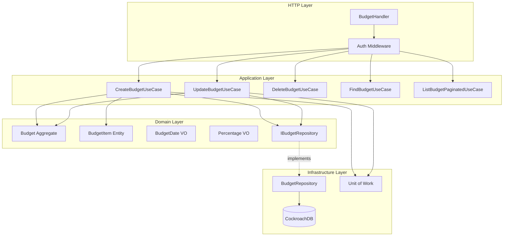
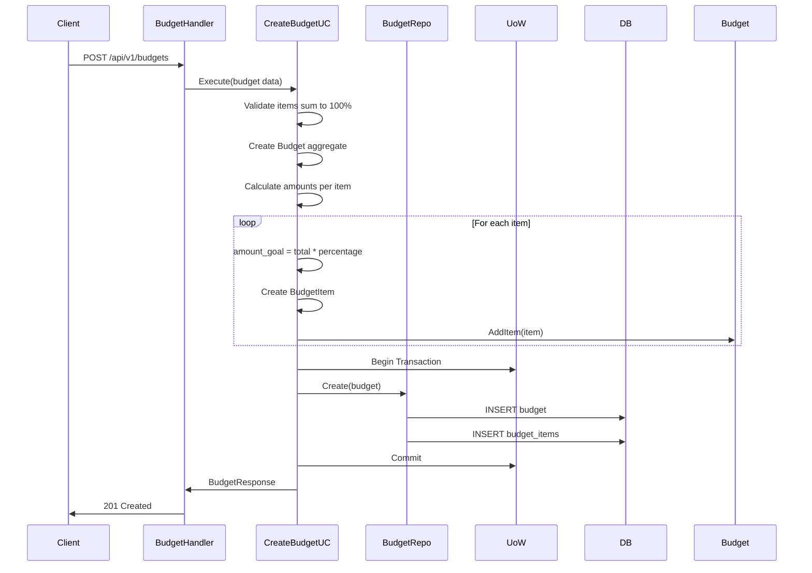
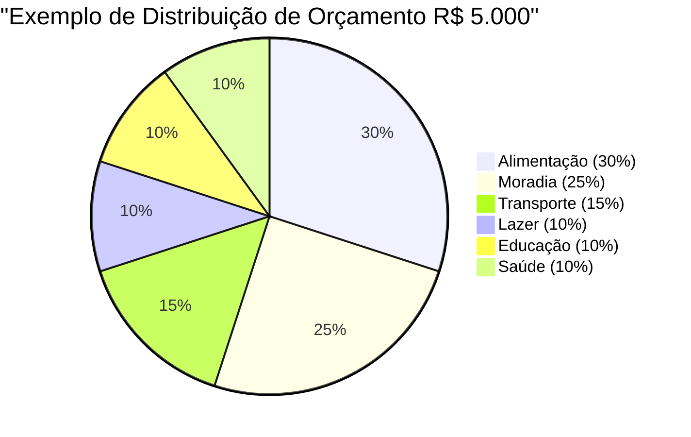

# Budget Module

Módulo responsável pelo planejamento e gerenciamento de orçamentos mensais por categoria.

## Visão Geral

O módulo Budget permite criar orçamentos mensais com alocação percentual e monetária por categoria. Funciona como uma ferramenta de planejamento financeiro, permitindo que usuários definam quanto pretendem gastar em cada categoria e acompanhem o uso do orçamento.

## Arquitetura



### Fluxo de Criação de Orçamento



### Distribuição Percentual



## Estrutura do Módulo

```
internal/budget/
├── application/
│   ├── dtos/
│   │   └── budget.go            # DTOs de request/response
│   └── usecase/
│       ├── create.go            # Criar orçamento
│       ├── update.go            # Atualizar orçamento
│       ├── delete.go            # Deletar orçamento
│       ├── find.go              # Buscar orçamento específico
│       └── list_paginated.go    # Listagem paginada
├── domain/
│   ├── entities/
│   │   ├── budget.go            # Budget aggregate root
│   │   └── budget_item.go       # BudgetItem entity
│   ├── vos/
│   │   ├── budget_date.go       # Value Object: Data do orçamento
│   │   └── percentage.go        # Value Object: Percentual (0-100)
│   └── interfaces/
│       └── budget_repository.go # Contrato de persistência
├── infrastructure/
│   ├── http/
│   │   ├── budget_handler.go    # HTTP handlers
│   │   └── budget_routes.go     # Registro de rotas
│   └── repositories/
│       └── budget_repository.go # Implementação do repositório
└── module.go                    # Setup, DI e Unit of Work
```

## API Endpoints

Todos os endpoints requerem autenticação via Bearer token.

### 1. Create Budget

Cria um novo orçamento mensal com items por categoria.

```http
POST /api/v1/budgets
Authorization: Bearer {token}
Content-Type: application/json
```

**Request Body:**
```json
{
  "date": "2026-02-01",
  "amount_goal": 5000.00,
  "items": [
    {
      "category_id": "770e8400-e29b-41d4-a716-446655440000",
      "percentage_goal": 30.0
    },
    {
      "category_id": "771e8400-e29b-41d4-a716-446655440000",
      "percentage_goal": 25.0
    },
    {
      "category_id": "772e8400-e29b-41d4-a716-446655440000",
      "percentage_goal": 15.0
    },
    {
      "category_id": "773e8400-e29b-41d4-a716-446655440000",
      "percentage_goal": 30.0
    }
  ]
}
```

**Validações:**
- Soma de `percentage_goal` deve ser exatamente 100%
- `amount_goal` deve ser > 0
- Apenas um orçamento por mês por usuário

**Success Response (201 Created):**
```json
{
  "data": {
    "id": "880e8400-e29b-41d4-a716-446655440000",
    "user_id": "660e8400-e29b-41d4-a716-446655440000",
    "date": "2026-02-01",
    "amount_goal": 5000.00,
    "amount_used": 0.00,
    "percentage_used": 0.0,
    "items": [
      {
        "id": "990e8400-e29b-41d4-a716-446655440000",
        "category_id": "770e8400-e29b-41d4-a716-446655440000",
        "category_name": "Alimentação",
        "percentage_goal": 30.0,
        "amount_goal": 1500.00,
        "amount_used": 0.00
      },
      {
        "id": "991e8400-e29b-41d4-a716-446655440000",
        "category_id": "771e8400-e29b-41d4-a716-446655440000",
        "category_name": "Moradia",
        "percentage_goal": 25.0,
        "amount_goal": 1250.00,
        "amount_used": 0.00
      }
    ],
    "created_at": "2026-01-30T10:00:00Z",
    "updated_at": "2026-01-30T10:00:00Z"
  }
}
```

**Error Responses:**
- `400 Bad Request` - Percentuais não somam 100% ou dados inválidos
- `409 Conflict` - Orçamento já existe para este mês
- `404 Not Found` - Categoria não encontrada

### 2. List Budgets (Paginated)

Lista orçamentos do usuário com paginação.

```http
GET /api/v1/budgets?limit=20&cursor=eyJm...
Authorization: Bearer {token}
```

**Query Parameters:**
- `limit` (opcional): Número de resultados (default: 20, max: 100)
- `cursor` (opcional): Token de paginação

**Success Response (200 OK):**
```json
{
  "data": [
    {
      "id": "880e8400-e29b-41d4-a716-446655440000",
      "user_id": "660e8400-e29b-41d4-a716-446655440000",
      "date": "2026-02-01",
      "amount_goal": 5000.00,
      "amount_used": 2350.50,
      "percentage_used": 47.01,
      "items_count": 4,
      "created_at": "2026-01-30T10:00:00Z",
      "updated_at": "2026-02-15T15:30:00Z"
    }
  ],
  "pagination": {
    "limit": 20,
    "has_next": true,
    "next_cursor": "eyJmaWVsZHMi..."
  }
}
```

### 3. Get Budget by ID

Busca um orçamento específico com todos os items.

```http
GET /api/v1/budgets/{id}
Authorization: Bearer {token}
```

**Success Response (200 OK):**
```json
{
  "data": {
    "id": "880e8400-e29b-41d4-a716-446655440000",
    "user_id": "660e8400-e29b-41d4-a716-446655440000",
    "date": "2026-02-01",
    "amount_goal": 5000.00,
    "amount_used": 2350.50,
    "percentage_used": 47.01,
    "items": [
      {
        "id": "990e8400-e29b-41d4-a716-446655440000",
        "category_id": "770e8400-e29b-41d4-a716-446655440000",
        "category_name": "Alimentação",
        "percentage_goal": 30.0,
        "amount_goal": 1500.00,
        "amount_used": 1250.00
      },
      {
        "id": "991e8400-e29b-41d4-a716-446655440000",
        "category_id": "771e8400-e29b-41d4-a716-446655440000",
        "category_name": "Moradia",
        "percentage_goal": 25.0,
        "amount_goal": 1250.00,
        "amount_used": 1100.50
      }
    ],
    "created_at": "2026-01-30T10:00:00Z",
    "updated_at": "2026-02-15T15:30:00Z"
  }
}
```

**Error Responses:**
- `404 Not Found` - Orçamento não encontrado

### 4. Update Budget

Atualiza um orçamento existente.

```http
PUT /api/v1/budgets/{id}
Authorization: Bearer {token}
Content-Type: application/json
```

**Request Body:**
```json
{
  "amount_goal": 5500.00,
  "items": [
    {
      "category_id": "770e8400-e29b-41d4-a716-446655440000",
      "percentage_goal": 35.0
    },
    {
      "category_id": "771e8400-e29b-41d4-a716-446655440000",
      "percentage_goal": 20.0
    },
    {
      "category_id": "772e8400-e29b-41d4-a716-446655440000",
      "percentage_goal": 45.0
    }
  ]
}
```

**Observações:**
- Items existentes são removidos e recriados
- Percentuais devem somar 100%
- `amount_used` é preservado e recalcula `percentage_used`

**Success Response (200 OK):**
```json
{
  "data": {
    "id": "880e8400-e29b-41d4-a716-446655440000",
    "user_id": "660e8400-e29b-41d4-a716-446655440000",
    "date": "2026-02-01",
    "amount_goal": 5500.00,
    "amount_used": 2350.50,
    "percentage_used": 42.74,
    "items": [
      {
        "id": "992e8400-e29b-41d4-a716-446655440000",
        "category_id": "770e8400-e29b-41d4-a716-446655440000",
        "category_name": "Alimentação",
        "percentage_goal": 35.0,
        "amount_goal": 1925.00,
        "amount_used": 1250.00
      }
    ],
    "created_at": "2026-01-30T10:00:00Z",
    "updated_at": "2026-02-16T10:00:00Z"
  }
}
```

**Error Responses:**
- `400 Bad Request` - Percentuais não somam 100% ou dados inválidos
- `404 Not Found` - Orçamento não encontrado

### 5. Delete Budget

Remove um orçamento (soft delete).

```http
DELETE /api/v1/budgets/{id}
Authorization: Bearer {token}
```

**Success Response (204 No Content)**

**Error Responses:**
- `404 Not Found` - Orçamento não encontrado

## Domain Model

### Budget (Aggregate Root)

```go
type Budget struct {
    ID             uuid.UUID
    UserID         uuid.UUID
    Date           BudgetDate     // Primeiro dia do mês
    AmountGoal     Money
    AmountUsed     Money
    PercentageUsed Percentage
    Items          []*BudgetItem
    CreatedAt      time.Time
    UpdatedAt      time.Time
    DeletedAt      *time.Time
}
```

**Business Methods:**
```go
func (b *Budget) AddItem(item *BudgetItem) error
func (b *Budget) RemoveItem(itemID uuid.UUID) error
func (b *Budget) UpdateItem(itemID uuid.UUID, updates *BudgetItem) error
func (b *Budget) RecalculateAmounts()
func (b *Budget) UpdateUsage(categoryID uuid.UUID, amountUsed Money) error
func (b *Budget) GetRemainingAmount() Money
```

**Invariantes:**
- Soma de `Items.PercentageGoal` deve ser 100%
- `AmountUsed` não pode ser negativo
- `PercentageUsed` = (AmountUsed / AmountGoal) * 100
- Apenas um budget por mês por usuário

### BudgetItem (Entity)

```go
type BudgetItem struct {
    ID             uuid.UUID
    BudgetID       uuid.UUID
    CategoryID     uuid.UUID
    PercentageGoal Percentage    // 0-100
    AmountGoal     Money          // Calculado: budget.AmountGoal * percentage
    AmountUsed     Money
    CreatedAt      time.Time
    UpdatedAt      time.Time
}
```

**Validações:**
- `PercentageGoal` entre 0.01 e 100
- `AmountGoal` = `Budget.AmountGoal` * (`PercentageGoal` / 100)
- `AmountUsed` inicializa em 0

### Value Objects

#### BudgetDate

```go
type BudgetDate struct {
    value time.Time  // Normalizado para primeiro dia do mês
}
```

**Formato:** Sempre primeiro dia do mês (e.g., `2026-02-01`)

**Métodos:**
```go
func NewBudgetDate(date time.Time) BudgetDate
func (bd BudgetDate) Month() int
func (bd BudgetDate) Year() int
func (bd BudgetDate) String() string // "2026-02"
```

#### Percentage

```go
type Percentage struct {
    value float64  // 0.00 - 100.00
}
```

**Validações:**
- Range: 0.00 a 100.00
- Precisão: 2 casas decimais

## Business Rules

### 1. Validação de Percentuais

**Regra:** Soma de todos os `percentage_goal` dos items deve ser exatamente 100%

```go
totalPercentage := 0.0
for _, item := range items {
    totalPercentage += item.PercentageGoal
}

if totalPercentage != 100.0 {
    return ErrPercentageMustSumTo100
}
```

**Tolerância:** 0.01 (permite 99.99% ou 100.01%)

### 2. Cálculo de Amount Goal por Item

```go
itemAmountGoal = budgetAmountGoal * (itemPercentageGoal / 100)
```

**Exemplo:**
- Budget: R$ 5.000,00
- Item: 30%
- **Item Amount Goal:** R$ 1.500,00

### 3. Cálculo de Percentage Used

```go
percentageUsed = (amountUsed / amountGoal) * 100
```

**Exemplo:**
- Amount Goal: R$ 5.000,00
- Amount Used: R$ 2.350,50
- **Percentage Used:** 47.01%

### 4. Unicidade por Mês

**Regra:** Apenas um orçamento por usuário por mês

**Validação:** Constraint no banco de dados

```sql
UNIQUE INDEX idx_budgets_unique_user_date
    ON budgets(user_id, date)
    WHERE deleted_at IS NULL
```

### 5. Unit of Work

Operações que modificam budget + items usam transação:
- Create: INSERT budget + INSERT items
- Update: UPDATE budget + DELETE old items + INSERT new items
- Delete: UPDATE budget.deleted_at + UPDATE items.deleted_at

## Database Schema

```sql
CREATE TABLE budgets (
    id UUID PRIMARY KEY DEFAULT gen_random_uuid(),
    user_id UUID NOT NULL REFERENCES users(id),
    date DATE NOT NULL,
    amount_goal NUMERIC(19,2) NOT NULL CHECK (amount_goal > 0),
    amount_used NUMERIC(19,2) NOT NULL DEFAULT 0 CHECK (amount_used >= 0),
    percentage_used NUMERIC(6,3) NOT NULL DEFAULT 0,
    created_at TIMESTAMPTZ NOT NULL DEFAULT NOW(),
    updated_at TIMESTAMPTZ NOT NULL DEFAULT NOW(),
    deleted_at TIMESTAMPTZ
);

CREATE TABLE budget_items (
    id UUID PRIMARY KEY DEFAULT gen_random_uuid(),
    budget_id UUID NOT NULL REFERENCES budgets(id),
    category_id UUID NOT NULL REFERENCES categories(id),
    percentage_goal NUMERIC(6,3) NOT NULL CHECK (percentage_goal > 0 AND percentage_goal <= 100),
    amount_goal NUMERIC(19,2) NOT NULL CHECK (amount_goal > 0),
    amount_used NUMERIC(19,2) NOT NULL DEFAULT 0 CHECK (amount_used >= 0),
    created_at TIMESTAMPTZ NOT NULL DEFAULT NOW(),
    updated_at TIMESTAMPTZ NOT NULL DEFAULT NOW()
);

-- Indexes
CREATE INDEX idx_budgets_user_date ON budgets(user_id, date) WHERE deleted_at IS NULL;
CREATE INDEX idx_budget_items_budget_id ON budget_items(budget_id);
CREATE INDEX idx_budget_items_category_id ON budget_items(category_id);

-- Unique constraint: Um orçamento por usuário por mês
CREATE UNIQUE INDEX idx_budgets_unique_user_date
    ON budgets(user_id, date)
    WHERE deleted_at IS NULL;
```

## Métricas

**Status:** Não implementadas

O módulo Budget atualmente não possui métricas customizadas. As seguintes métricas são candidatas para implementação futura:

### Métricas Sugeridas

- `financial_budget_operations_total` - Total de operações por tipo
- `financial_budget_errors_total` - Total de erros
- `financial_budget_operation_duration_seconds` - Latência de operações
- `financial_budget_total_goal` - Soma de amount_goal de todos os budgets ativos
- `financial_budget_total_used` - Soma de amount_used
- `financial_budget_percentage_used_avg` - Percentual médio usado
- `financial_budget_over_budget_total` - Orçamentos estourados (used > goal)

### PromQL Queries (Futuras)

```promql
# Taxa de criação de orçamentos
rate(financial_budget_operations_total{operation="create"}[5m])

# Percentual médio usado
avg(financial_budget_percentage_used_avg)

# Orçamentos estourados
financial_budget_over_budget_total

# Total planejado vs usado
financial_budget_total_goal - financial_budget_total_used
```

## Interfaces de Domínio

### IBudgetRepository

```go
type IBudgetRepository interface {
    Create(ctx context.Context, budget *entities.Budget) error
    Update(ctx context.Context, budget *entities.Budget) error
    Delete(ctx context.Context, id uuid.UUID) error
    FindByID(ctx context.Context, id uuid.UUID) (*entities.Budget, error)
    FindByUserAndDate(ctx context.Context, userID uuid.UUID, date time.Time) (*entities.Budget, error)
    FindPaginated(ctx context.Context, userID uuid.UUID, limit int, cursor string) ([]*entities.Budget, bool, string, error)

    // Budget Item operations
    CreateItem(ctx context.Context, item *entities.BudgetItem) error
    DeleteItemsByBudget(ctx context.Context, budgetID uuid.UUID) error
}
```

## Use Cases

### 1. CreateBudgetUseCase

**Responsabilidade:** Criar orçamento mensal com items

**Fluxo:**
1. Validar que percentuais somam 100%
2. Validar que não existe budget para o mês
3. Criar Budget aggregate
4. Para cada item:
   - Calcular `amount_goal` = `budget.amount_goal` * `percentage`
   - Criar BudgetItem
   - Adicionar ao budget
5. Persistir com Unit of Work

**Unit of Work:** Sim

**Validações:**
- Percentuais somam 100% (±0.01 tolerância)
- Amount goal > 0
- Categorias existem
- Não existe budget para o mês

### 2. UpdateBudgetUseCase

**Responsabilidade:** Atualizar orçamento existente

**Fluxo:**
1. Buscar budget por ID
2. Validar novos percentuais somam 100%
3. Remover items antigos
4. Criar novos items com novos percentuais
5. Recalcular amounts
6. Preservar `amount_used` e recalcular `percentage_used`
7. Persistir com Unit of Work

**Unit of Work:** Sim

### 3. DeleteBudgetUseCase

**Responsabilidade:** Soft delete de orçamento

**Fluxo:**
1. Buscar budget por ID
2. Soft delete budget
3. Soft delete items associados
4. Persistir

**Observação:** Não usa UoW pois é apenas UPDATE em duas tabelas

### 4. FindBudgetUseCase

**Responsabilidade:** Buscar budget específico com items

**Inclui:** Items com categoria (eager loading)

### 5. ListBudgetPaginatedUseCase

**Responsabilidade:** Listar budgets com paginação

**Ordenação:** Por date DESC (mês mais recente primeiro)

## Integration

### Atualização de Amount Used (Futura)

O campo `amount_used` é atualizado quando:
1. Transação é registrada com categoria
2. Busca budget ativo do mês
3. Busca item do budget para a categoria
4. Incrementa `item.amount_used`
5. Recalcula `budget.amount_used` e `budget.percentage_used`

**Não implementado ainda:** Integração automática com Transaction module

## Dependências

### Externas
- `github.com/JailtonJunior94/devkit-go` - UoW, Money VO, Entity base
- `github.com/google/uuid` - UUID generation

### Internas
- `pkg/pagination` - Cursor-based pagination
- `pkg/custom_errors` - Domain errors
- `pkg/api/http` - HTTP response utilities

## Testing

### Unit Tests

```bash
go test ./internal/budget/... -v
go test ./internal/budget/... -cover
```

### Integration Tests

```bash
go test -tags=integration ./internal/budget/... -v
```

### Test Cases Importantes

1. **Percentage Validation**
   - Items somam 100% → sucesso
   - Items somam 99% → erro
   - Items somam 101% → erro

2. **Amount Calculation**
   - Budget R$ 5.000 com 30% → Item R$ 1.500
   - Validar arredondamento correto

3. **Uniqueness**
   - Criar budget para 2026-02
   - Tentar criar outro para 2026-02
   - Deve retornar erro de conflito

4. **Unit of Work**
   - Rollback em caso de erro
   - Commit apenas se todas operações sucederem

## Usage Examples

### cURL Examples

**Create Budget:**
```bash
curl -X POST http://localhost:8000/api/v1/budgets \
  -H "Authorization: Bearer $TOKEN" \
  -H "Content-Type: application/json" \
  -d '{
    "date": "2026-02-01",
    "amount_goal": 5000.00,
    "items": [
      {
        "category_id": "770e8400-e29b-41d4-a716-446655440000",
        "percentage_goal": 30.0
      },
      {
        "category_id": "771e8400-e29b-41d4-a716-446655440000",
        "percentage_goal": 25.0
      },
      {
        "category_id": "772e8400-e29b-41d4-a716-446655440000",
        "percentage_goal": 45.0
      }
    ]
  }'
```

**List Budgets:**
```bash
curl -X GET http://localhost:8000/api/v1/budgets \
  -H "Authorization: Bearer $TOKEN"
```

**Get Budget:**
```bash
curl -X GET http://localhost:8000/api/v1/budgets/{id} \
  -H "Authorization: Bearer $TOKEN"
```

**Update Budget:**
```bash
curl -X PUT http://localhost:8000/api/v1/budgets/{id} \
  -H "Authorization: Bearer $TOKEN" \
  -H "Content-Type: application/json" \
  -d '{
    "amount_goal": 5500.00,
    "items": [
      {
        "category_id": "770e8400-e29b-41d4-a716-446655440000",
        "percentage_goal": 35.0
      },
      {
        "category_id": "771e8400-e29b-41d4-a716-446655440000",
        "percentage_goal": 65.0
      }
    ]
  }'
```

**Delete Budget:**
```bash
curl -X DELETE http://localhost:8000/api/v1/budgets/{id} \
  -H "Authorization: Bearer $TOKEN"
```

## Best Practices

### Percentage Distribution

**Recomendações:**
```
📊 Distribuição 50/30/20 (Regra popular):
- 50% Necessidades (moradia, alimentação, contas)
- 30% Desejos (lazer, entretenimento)
- 20% Poupança/Investimentos

📊 Distribuição conservadora:
- 60% Necessidades
- 20% Desejos
- 20% Poupança

📊 Distribuição agressiva:
- 40% Necessidades
- 30% Investimentos
- 30% Desejos
```

### Aggregate Consistency

**Budget é um Aggregate Root:**
- Sempre modificar items através do Budget
- Usar métodos `AddItem`, `RemoveItem`, `UpdateItem`
- Recalcular amounts automaticamente

### Error Handling

```go
// Budget not found
custom_errors.NewNotFoundError("budget", budgetID)

// Percentages don't sum to 100%
custom_errors.NewValidationError(map[string][]string{
    "items": {"percentage_goal must sum to 100%"},
})

// Budget already exists for month
custom_errors.NewConflictError("budget already exists for this month")

// Invalid percentage
custom_errors.NewValidationError(map[string][]string{
    "percentage_goal": {"must be between 0.01 and 100"},
})
```

## Roadmap

### Futuras Implementações

- [ ] Implementar métricas customizadas
- [ ] Integração automática com Transaction module (atualizar amount_used)
- [ ] Alertas de orçamento (80%, 100% usado)
- [ ] Comparação de orçamentos (mês a mês)
- [ ] Templates de orçamento (predefinidos)
- [ ] Cópia de orçamento para próximo mês
- [ ] Orçamento por projeto/objetivo
- [ ] Orçamento anual
- [ ] Relatórios de aderência ao orçamento
- [ ] Sugestões de ajuste baseadas em histórico

### Análises Futuras

- **Budget vs Actual:** Comparar planejado vs executado
- **Trend Analysis:** Tendências de gasto por categoria
- **Variance Analysis:** Variação entre meses
- **Forecast:** Projeção de gastos

## Referências

- [Zero-Based Budgeting](https://en.wikipedia.org/wiki/Zero-based_budgeting)
- [50/30/20 Budget Rule](https://www.investopedia.com/ask/answers/022916/what-502030-budget-rule.asp)
- [Personal Finance Best Practices](https://www.nerdwallet.com/article/finance/how-to-budget)
