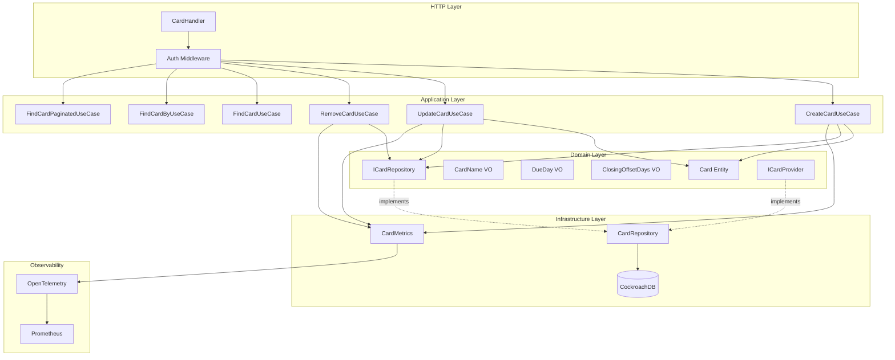
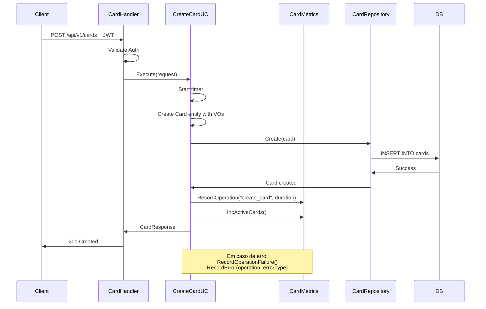
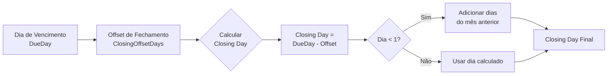

# Card Module

Módulo responsável pelo gerenciamento de cartões de crédito e cálculo de ciclos de faturamento.

## Visão Geral

O módulo Card gerencia cartões de crédito dos usuários, incluindo informações de vencimento, fechamento de fatura e integração com o módulo de faturas (Invoice). É o único módulo com instrumentação completa de métricas OpenTelemetry.

## Arquitetura



### Fluxo de Criação de Card



### Cálculo de Ciclo de Faturamento



**Exemplo:**
- Due Day: 15 (vencimento dia 15)
- Closing Offset Days: 7
- **Closing Day: 8** (fatura fecha dia 8)
- **Período de compras:** dia 9 do mês anterior até dia 8 do mês atual

## Estrutura do Módulo

```
internal/card/
├── application/
│   ├── dtos/
│   │   └── card.go              # DTOs de request/response
│   └── usecase/
│       ├── create.go            # Criar cartão
│       ├── update.go            # Atualizar cartão
│       ├── remove.go            # Remover cartão
│       ├── find.go              # Listar todos
│       ├── find_by.go           # Buscar por ID
│       └── find_paginated.go    # Listagem paginada
├── domain/
│   ├── entities/
│   │   └── card.go              # Card aggregate root
│   ├── vos/
│   │   ├── card_name.go         # Value Object: Nome
│   │   ├── due_day.go           # Value Object: Dia vencimento
│   │   └── closing_offset_days.go # Value Object: Offset fechamento
│   └── interfaces/
│       └── card_repository.go   # Contrato de persistência
├── infrastructure/
│   ├── adapters/
│   │   └── card_provider_adapter.go # Provider para Invoice module
│   ├── http/
│   │   ├── card_handler.go      # HTTP handlers
│   │   └── card_routes.go       # Registro de rotas
│   └── repositories/
│       └── card_repository.go   # Implementação do repositório
└── module.go                    # Setup, DI e métricas
```

## API Endpoints

Todos os endpoints requerem autenticação via Bearer token.

### 1. List Cards (Paginated)

Lista cartões do usuário autenticado com paginação cursor-based.

```http
GET /api/v1/cards?limit=20&cursor=eyJm...
Authorization: Bearer {token}
```

**Query Parameters:**
- `limit` (opcional): Número de resultados (default: 20, max: 100)
- `cursor` (opcional): Token de paginação para próxima página

**Success Response (200 OK):**
```json
{
  "data": [
    {
      "id": "550e8400-e29b-41d4-a716-446655440000",
      "user_id": "660e8400-e29b-41d4-a716-446655440000",
      "name": "Nubank",
      "due_day": 15,
      "closing_offset_days": 7,
      "closing_day": 8,
      "created_at": "2026-01-30T10:00:00Z",
      "updated_at": "2026-01-30T10:00:00Z"
    }
  ],
  "pagination": {
    "limit": 20,
    "has_next": true,
    "next_cursor": "eyJmaWVsZHMiOlt7ImZpZWxkIjoiaWQi..."
  }
}
```

### 2. Get Card by ID

Busca um cartão específico por ID.

```http
GET /api/v1/cards/{id}
Authorization: Bearer {token}
```

**Success Response (200 OK):**
```json
{
  "data": {
    "id": "550e8400-e29b-41d4-a716-446655440000",
    "user_id": "660e8400-e29b-41d4-a716-446655440000",
    "name": "Nubank",
    "due_day": 15,
    "closing_offset_days": 7,
    "closing_day": 8,
    "created_at": "2026-01-30T10:00:00Z",
    "updated_at": "2026-01-30T10:00:00Z"
  }
}
```

**Error Responses:**
- `404 Not Found` - Cartão não encontrado

### 3. Create Card

Cria um novo cartão para o usuário autenticado.

```http
POST /api/v1/cards
Authorization: Bearer {token}
Content-Type: application/json
```

**Request Body:**
```json
{
  "name": "Nubank",
  "due_day": 15,
  "closing_offset_days": 7
}
```

**Success Response (201 Created):**
```json
{
  "data": {
    "id": "550e8400-e29b-41d4-a716-446655440000",
    "user_id": "660e8400-e29b-41d4-a716-446655440000",
    "name": "Nubank",
    "due_day": 15,
    "closing_offset_days": 7,
    "closing_day": 8,
    "created_at": "2026-01-30T10:00:00Z",
    "updated_at": "2026-01-30T10:00:00Z"
  }
}
```

**Error Responses:**
- `400 Bad Request` - Dados inválidos (due_day fora do range 1-31)

### 4. Update Card

Atualiza informações de um cartão existente.

```http
PUT /api/v1/cards/{id}
Authorization: Bearer {token}
Content-Type: application/json
```

**Request Body:**
```json
{
  "name": "Nubank Platinum",
  "due_day": 20,
  "closing_offset_days": 10
}
```

**Success Response (200 OK):**
```json
{
  "data": {
    "id": "550e8400-e29b-41d4-a716-446655440000",
    "user_id": "660e8400-e29b-41d4-a716-446655440000",
    "name": "Nubank Platinum",
    "due_day": 20,
    "closing_offset_days": 10,
    "closing_day": 10,
    "created_at": "2026-01-30T10:00:00Z",
    "updated_at": "2026-01-30T11:30:00Z"
  }
}
```

**Error Responses:**
- `400 Bad Request` - Dados inválidos
- `404 Not Found` - Cartão não encontrado

### 5. Delete Card

Remove um cartão (soft delete).

```http
DELETE /api/v1/cards/{id}
Authorization: Bearer {token}
```

**Success Response (204 No Content)**

**Error Responses:**
- `404 Not Found` - Cartão não encontrado

## Domain Model

### Card Entity (Aggregate Root)

```go
type Card struct {
    ID                 uuid.UUID
    UserID             uuid.UUID
    Name               CardName
    DueDay             DueDay
    ClosingOffsetDays  ClosingOffsetDays
    CreatedAt          time.Time
    UpdatedAt          time.Time
    DeletedAt          *time.Time
}
```

**Business Methods:**
```go
func (c *Card) CalculateClosingDay() int
```

### Value Objects

#### CardName

```go
type CardName struct {
    value string
}
```

**Validações:**
- Não pode ser vazio
- Comprimento máximo: 255 caracteres

#### DueDay

```go
type DueDay struct {
    value int
}
```

**Validações:**
- Range: 1 a 31
- Representa o dia do mês do vencimento da fatura

#### ClosingOffsetDays

```go
type ClosingOffsetDays struct {
    value int
}
```

**Validações:**
- Range: 1 a 31
- Default: 7 dias
- Dias antes do vencimento para fechamento da fatura

### Cálculo de Closing Day

**Lógica:**
```
closing_day = due_day - closing_offset_days

Se closing_day < 1:
  closing_day = closing_day + days_in_previous_month
```

**Exemplos:**
| Due Day | Offset | Closing Day | Explicação |
|---------|--------|-------------|------------|
| 15 | 7 | 8 | 15 - 7 = 8 |
| 5 | 7 | 28/29/30/31 | Vai para mês anterior |
| 31 | 10 | 21 | 31 - 10 = 21 |
| 10 | 5 | 5 | 10 - 5 = 5 |

## Database Schema

```sql
CREATE TABLE cards (
    id UUID PRIMARY KEY DEFAULT gen_random_uuid(),
    user_id UUID NOT NULL REFERENCES users(id),
    name VARCHAR(255) NOT NULL,
    due_day INT NOT NULL CHECK (due_day >= 1 AND due_day <= 31),
    closing_offset_days INT NOT NULL DEFAULT 7 CHECK (closing_offset_days >= 1 AND closing_offset_days <= 31),
    created_at TIMESTAMPTZ NOT NULL DEFAULT NOW(),
    updated_at TIMESTAMPTZ NOT NULL DEFAULT NOW(),
    deleted_at TIMESTAMPTZ
);

CREATE INDEX idx_cards_user_id ON cards(user_id) WHERE deleted_at IS NULL;
CREATE INDEX idx_cards_deleted_at ON cards(deleted_at);
```

## Métricas (OpenTelemetry)

O módulo Card possui instrumentação completa com métricas OpenTelemetry.

### Métricas Implementadas

#### 1. Operations Counter

**Nome:** `financial.card.operations.total`
**Tipo:** Counter
**Descrição:** Total de operações executadas

**Labels:**
- `operation` - Tipo de operação (create_card, update_card, remove_card, list_cards, get_card, list_paginated_cards)
- `status` - Resultado (success, failure)

**Uso:**
```go
metrics.RecordOperation(ctx, "create_card", duration)
metrics.RecordOperationFailure(ctx, "create_card", duration)
```

#### 2. Errors Counter

**Nome:** `financial.card.errors.total`
**Tipo:** Counter
**Descrição:** Total de erros por tipo

**Labels:**
- `operation` - Operação que falhou
- `error_type` - Classificação do erro (validation, not_found, parsing, repository, unknown)

**Uso:**
```go
metrics.RecordError(ctx, "create_card", "validation")
```

**Classificação de Erros:**
```go
validation   - Erros de validação de input
not_found    - Recurso não encontrado
parsing      - Erro ao parsear UUID ou converter tipos
repository   - Erros de banco de dados/conexão
unknown      - Erros não classificados
```

#### 3. Operation Duration Histogram

**Nome:** `financial.card.operation.duration.seconds`
**Tipo:** Histogram
**Descrição:** Latência das operações

**Labels:**
- `operation` - Tipo de operação

**Buckets (segundos):**
```
[0.001, 0.005, 0.01, 0.025, 0.05, 0.1, 0.25, 0.5, 1, 2.5, 5]
```

**Uso:**
```go
start := time.Now()
// ... operação ...
duration := time.Since(start)
metrics.RecordOperation(ctx, "create_card", duration)
```

#### 4. Active Cards Gauge

**Nome:** `financial.card.active.total`
**Tipo:** UpDownCounter
**Descrição:** Número total de cartões ativos

**Uso:**
```go
metrics.IncActiveCards(ctx)  // Ao criar
metrics.DecActiveCards(ctx)  // Ao remover
metrics.SetActiveCards(ctx, count)  // Definir valor absoluto
```

### PromQL Queries

#### Taxa de Operações por Segundo

```promql
# Operações totais por segundo
sum(rate(financial_card_operations_total[5m])) by (operation)

# Apenas sucessos
sum(rate(financial_card_operations_total{status="success"}[5m])) by (operation)

# Apenas falhas
sum(rate(financial_card_operations_total{status="failure"}[5m])) by (operation)
```

#### Taxa de Erro

```promql
# Percentual de erro geral
sum(rate(financial_card_operations_total{status="failure"}[5m]))
  /
sum(rate(financial_card_operations_total[5m])) * 100

# Taxa de erro por operação
sum(rate(financial_card_operations_total{status="failure"}[5m])) by (operation)
  /
sum(rate(financial_card_operations_total[5m])) by (operation) * 100
```

#### Latência (Percentis)

```promql
# P50 latência por operação
histogram_quantile(0.50,
  sum(rate(financial_card_operation_duration_seconds_bucket[5m])) by (le, operation)
)

# P95 latência por operação
histogram_quantile(0.95,
  sum(rate(financial_card_operation_duration_seconds_bucket[5m])) by (le, operation)
)

# P99 latência por operação
histogram_quantile(0.99,
  sum(rate(financial_card_operation_duration_seconds_bucket[5m])) by (le, operation)
)

# Latência média
sum(rate(financial_card_operation_duration_seconds_sum[5m])) by (operation)
  /
sum(rate(financial_card_operation_duration_seconds_count[5m])) by (operation)
```

#### Análise de Erros

```promql
# Top 5 tipos de erro
topk(5, sum(rate(financial_card_errors_total[5m])) by (error_type))

# Erros por operação
sum(rate(financial_card_errors_total[5m])) by (operation, error_type)

# Erros de validação
sum(rate(financial_card_errors_total{error_type="validation"}[5m]))

# Erros de repositório (banco de dados)
sum(rate(financial_card_errors_total{error_type="repository"}[5m]))
```

#### Cartões Ativos

```promql
# Total de cartões ativos
financial_card_active_total

# Crescimento de cartões (últimas 24h)
financial_card_active_total - financial_card_active_total offset 24h
```

### Grafana Dashboard Recomendado

**Painéis Sugeridos:**

1. **Overview**
   - Total de operações/segundo (gauge)
   - Taxa de erro % (gauge com threshold)
   - Latência P95 (gauge)
   - Cartões ativos (counter)

2. **Operations**
   - Gráfico de linha: Operações por tipo ao longo do tempo
   - Gráfico de barras: Volume por operação (últimas 24h)

3. **Latency**
   - Gráfico de linha: P50, P95, P99 por operação
   - Heatmap: Distribuição de latência

4. **Errors**
   - Gráfico de pizza: Erros por tipo
   - Gráfico de linha: Taxa de erro ao longo do tempo
   - Tabela: Top erros por operação

5. **Active Cards**
   - Gráfico de área: Evolução de cartões ativos
   - Stat: Total atual

### Prometheus Alerts

```yaml
groups:
  - name: card_alerts
    rules:
      # Alta taxa de erro
      - alert: CardHighErrorRate
        expr: |
          sum(rate(financial_card_operations_total{status="failure"}[5m]))
          /
          sum(rate(financial_card_operations_total[5m])) * 100 > 5
        for: 5m
        labels:
          severity: warning
        annotations:
          summary: "Alta taxa de erro em operações de Card"
          description: "Taxa de erro está em {{ $value }}% (threshold: 5%)"

      # Latência elevada
      - alert: CardHighLatency
        expr: |
          histogram_quantile(0.95,
            sum(rate(financial_card_operation_duration_seconds_bucket[5m])) by (le, operation)
          ) > 1
        for: 5m
        labels:
          severity: warning
        annotations:
          summary: "Latência P95 elevada em {{ $labels.operation }}"
          description: "P95 está em {{ $value }}s (threshold: 1s)"

      # Muitos erros de repositório
      - alert: CardRepositoryErrors
        expr: |
          sum(rate(financial_card_errors_total{error_type="repository"}[5m])) > 1
        for: 2m
        labels:
          severity: critical
        annotations:
          summary: "Erros de repositório em Card module"
          description: "Possível problema de conectividade com o banco"
```

## Interfaces de Domínio

### ICardRepository

```go
type ICardRepository interface {
    Create(ctx context.Context, card *entities.Card) error
    Update(ctx context.Context, card *entities.Card) error
    Delete(ctx context.Context, id uuid.UUID) error
    FindByUserID(ctx context.Context, userID uuid.UUID) ([]*entities.Card, error)
    FindByID(ctx context.Context, id uuid.UUID) (*entities.Card, error)
    FindPaginated(ctx context.Context, userID uuid.UUID, limit int, cursor string) ([]*entities.Card, bool, string, error)
}
```

### ICardProvider (Interface Exportada)

```go
type ICardProvider interface {
    FindByID(ctx context.Context, id uuid.UUID) (*entities.Card, error)
}
```

**Uso:** Permite que o módulo Invoice busque informações de cartões sem acoplamento direto.

## Use Cases

### 1. CreateCardUseCase

**Responsabilidade:** Criar novo cartão com validação e métricas

**Métricas:**
- Record operation duration
- Increment active cards on success
- Record validation/repository errors

### 2. UpdateCardUseCase

**Responsabilidade:** Atualizar cartão existente

**Métricas:**
- Record operation duration
- Record not_found, validation, parsing, and repository errors

### 3. RemoveCardUseCase

**Responsabilidade:** Soft delete de cartão

**Métricas:**
- Record operation duration
- Decrement active cards on success
- Record not_found and repository errors

### 4. FindCardUseCase

**Responsabilidade:** Listar todos os cartões do usuário

**Métricas:**
- Record listing duration
- Record parsing and repository errors

### 5. FindCardByUseCase

**Responsabilidade:** Buscar cartão por ID

**Métricas:**
- Record fetch duration
- Record not_found, parsing, and repository errors

### 6. FindCardPaginatedUseCase

**Responsabilidade:** Listagem paginada cursor-based

**Métricas:**
- Record paginated listing duration
- Record cursor decoding errors

## Integration

### CardProvider Adapter

O módulo Card exporta um adapter que implementa `ICardProvider` para uso pelo módulo Invoice:

```go
type CardProviderAdapter struct {
    repository interfaces.ICardRepository
}

func (a *CardProviderAdapter) FindByID(ctx context.Context, id uuid.UUID) (*entities.Card, error)
```

**Uso no Invoice Module:**
```go
cardProvider := cardModule.CardProvider()
card, err := cardProvider.FindByID(ctx, cardID)
```

## Dependências

### Externas
- `github.com/JailtonJunior94/devkit-go` - Observability, Database utilities
- `github.com/google/uuid` - UUID generation
- `go.opentelemetry.io/otel` - Metrics instrumentation

### Internas
- `pkg/pagination` - Cursor-based pagination
- `pkg/custom_errors` - Domain errors
- `pkg/observability/metrics` - Card metrics implementation
- `pkg/api/http` - HTTP response utilities

## Testing

### Unit Tests

```bash
# Run card module tests
go test ./internal/card/... -v

# With coverage
go test ./internal/card/... -cover
```

### Mock Generation

```bash
mockery --name=ICardRepository --dir=internal/card/domain/interfaces
```

### Test Metrics

```go
// Use test metrics to avoid global state
metrics := metrics.NewTestCardMetrics()
useCase := usecase.NewCreateCardUseCase(repo, metrics)
```

## Usage Examples

### cURL Examples

**Create Card:**
```bash
curl -X POST http://localhost:8000/api/v1/cards \
  -H "Authorization: Bearer $TOKEN" \
  -H "Content-Type: application/json" \
  -d '{
    "name": "Nubank",
    "due_day": 15,
    "closing_offset_days": 7
  }'
```

**List Cards:**
```bash
curl -X GET http://localhost:8000/api/v1/cards \
  -H "Authorization: Bearer $TOKEN"
```

**Update Card:**
```bash
curl -X PUT http://localhost:8000/api/v1/cards/{id} \
  -H "Authorization: Bearer $TOKEN" \
  -H "Content-Type: application/json" \
  -d '{
    "name": "Nubank Platinum",
    "due_day": 20,
    "closing_offset_days": 10
  }'
```

**Delete Card:**
```bash
curl -X DELETE http://localhost:8000/api/v1/cards/{id} \
  -H "Authorization: Bearer $TOKEN"
```

## Best Practices

### Metrics Instrumentation

1. **Always measure duration:**
   ```go
   start := time.Now()
   defer func() {
       duration := time.Since(start)
       if err := recover(); err != nil {
           metrics.RecordOperationFailure(ctx, operation, duration)
           panic(err)
       }
   }()
   ```

2. **Record both success and failure:**
   ```go
   if err != nil {
       metrics.RecordOperationFailure(ctx, operation, duration)
       metrics.RecordError(ctx, operation, metrics.ClassifyError(err))
       return err
   }
   metrics.RecordOperation(ctx, operation, duration)
   ```

3. **Update gauges consistently:**
   ```go
   // Ao criar
   metrics.IncActiveCards(ctx)

   // Ao remover
   metrics.DecActiveCards(ctx)
   ```

### Error Handling

```go
// Use custom errors
custom_errors.NewValidationError(map[string][]string{
    "due_day": {"must be between 1 and 31"},
})

custom_errors.NewNotFoundError("card", cardID)
```

## Roadmap

### Futuras Implementações

- [ ] Suporte a múltiplas bandeiras (Visa, Mastercard, Elo)
- [ ] Limite de crédito por cartão
- [ ] Alertas de vencimento
- [ ] Histórico de mudanças (audit log)
- [ ] Tags/categorização de cartões
- [ ] Compartilhamento de cartões (cartões adicionais)

## Referências

- [OpenTelemetry Metrics](https://opentelemetry.io/docs/specs/otel/metrics/)
- [Prometheus Best Practices](https://prometheus.io/docs/practices/naming/)
- [Cursor-Based Pagination](https://jsonapi.org/profiles/ethanresnick/cursor-pagination/)
