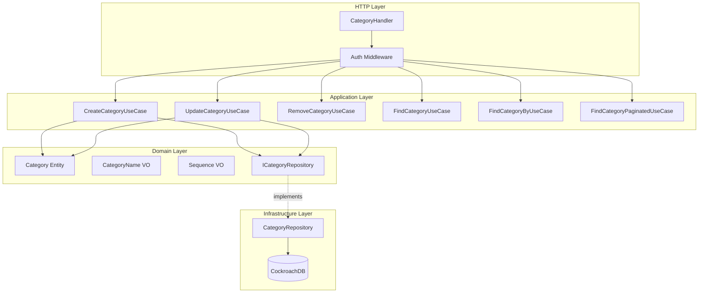
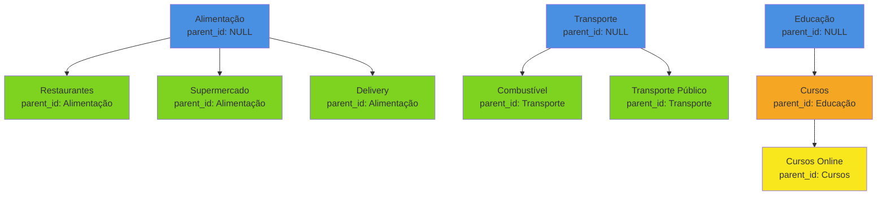
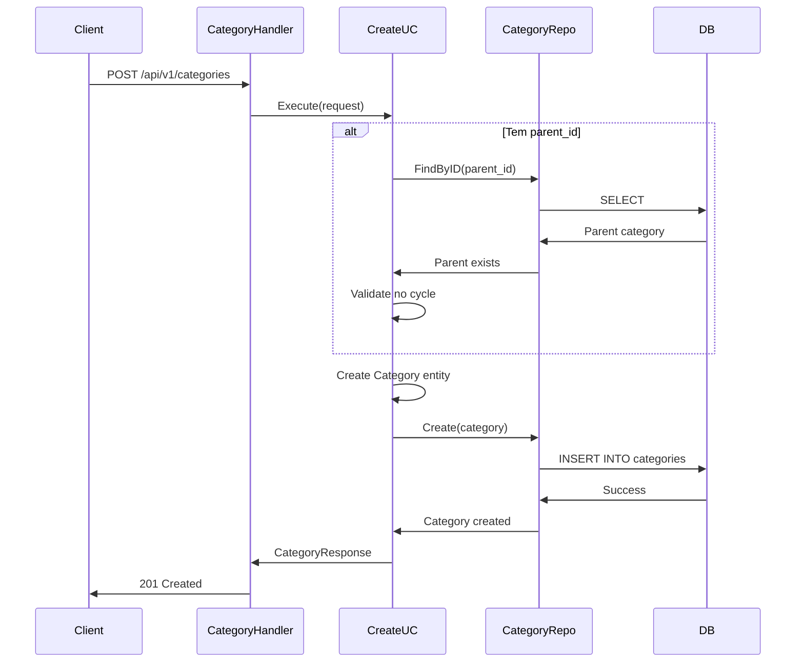

# Category Module

Módulo responsável pelo gerenciamento de categorias financeiras hierárquicas.

## Visão Geral

O módulo Category gerencia categorias de receitas e despesas com suporte a hierarquia (categorias pai e filhas), permitindo organização detalhada das transações financeiras. Inclui detecção de ciclos para evitar referências circulares.

## Arquitetura



### Hierarquia de Categorias



### Fluxo de Criação com Validação de Ciclo



## Estrutura do Módulo

```
internal/category/
├── application/
│   ├── dtos/
│   │   └── category.go          # DTOs de request/response
│   └── usecase/
│       ├── create.go            # Criar categoria
│       ├── update.go            # Atualizar categoria
│       ├── remove.go            # Remover categoria (soft delete)
│       ├── find.go              # Listar todas
│       ├── find_by.go           # Buscar por ID
│       └── find_paginated.go    # Listagem paginada
├── domain/
│   ├── entities/
│   │   └── category.go          # Category entity
│   ├── vos/
│   │   ├── category_name.go     # Value Object: Nome
│   │   └── sequence.go          # Value Object: Ordem de exibição
│   └── interfaces/
│       └── category_repository.go # Contrato de persistência
├── infrastructure/
│   ├── http/
│   │   ├── category_handler.go  # HTTP handlers
│   │   └── category_routes.go   # Registro de rotas
│   └── repositories/
│       └── category_repository.go # Implementação do repositório
└── module.go                    # Setup e DI do módulo
```

## API Endpoints

Todos os endpoints requerem autenticação via Bearer token.

### 1. List Categories (Paginated)

Lista categorias do usuário com paginação cursor-based.

```http
GET /api/v1/categories?limit=20&cursor=eyJm...
Authorization: Bearer {token}
```

**Query Parameters:**
- `limit` (opcional): Número de resultados (default: 20, max: 100)
- `cursor` (opcional): Token de paginação

**Success Response (200 OK):**
```json
{
  "data": [
    {
      "id": "550e8400-e29b-41d4-a716-446655440000",
      "user_id": "660e8400-e29b-41d4-a716-446655440000",
      "parent_id": null,
      "name": "Alimentação",
      "sequence": 1,
      "created_at": "2026-01-30T10:00:00Z",
      "updated_at": "2026-01-30T10:00:00Z"
    },
    {
      "id": "770e8400-e29b-41d4-a716-446655440000",
      "user_id": "660e8400-e29b-41d4-a716-446655440000",
      "parent_id": "550e8400-e29b-41d4-a716-446655440000",
      "name": "Restaurantes",
      "sequence": 1,
      "created_at": "2026-01-30T10:05:00Z",
      "updated_at": "2026-01-30T10:05:00Z"
    }
  ],
  "pagination": {
    "limit": 20,
    "has_next": false,
    "next_cursor": null
  }
}
```

### 2. Get Category by ID

Busca uma categoria específica por ID.

```http
GET /api/v1/categories/{id}
Authorization: Bearer {token}
```

**Success Response (200 OK):**
```json
{
  "data": {
    "id": "550e8400-e29b-41d4-a716-446655440000",
    "user_id": "660e8400-e29b-41d4-a716-446655440000",
    "parent_id": null,
    "name": "Alimentação",
    "sequence": 1,
    "created_at": "2026-01-30T10:00:00Z",
    "updated_at": "2026-01-30T10:00:00Z"
  }
}
```

**Error Responses:**
- `404 Not Found` - Categoria não encontrada

### 3. Create Category

Cria uma nova categoria (com ou sem parent).

```http
POST /api/v1/categories
Authorization: Bearer {token}
Content-Type: application/json
```

**Request Body (Categoria Principal):**
```json
{
  "name": "Alimentação",
  "sequence": 1
}
```

**Request Body (Subcategoria):**
```json
{
  "name": "Restaurantes",
  "parent_id": "550e8400-e29b-41d4-a716-446655440000",
  "sequence": 1
}
```

**Success Response (201 Created):**
```json
{
  "data": {
    "id": "770e8400-e29b-41d4-a716-446655440000",
    "user_id": "660e8400-e29b-41d4-a716-446655440000",
    "parent_id": "550e8400-e29b-41d4-a716-446655440000",
    "name": "Restaurantes",
    "sequence": 1,
    "created_at": "2026-01-30T10:05:00Z",
    "updated_at": "2026-01-30T10:05:00Z"
  }
}
```

**Error Responses:**
- `400 Bad Request` - Dados inválidos
- `404 Not Found` - Parent category não encontrada
- `409 Conflict` - Criaria ciclo na hierarquia

### 4. Update Category

Atualiza informações de uma categoria.

```http
PUT /api/v1/categories/{id}
Authorization: Bearer {token}
Content-Type: application/json
```

**Request Body:**
```json
{
  "name": "Alimentação e Bebidas",
  "parent_id": null,
  "sequence": 2
}
```

**Success Response (200 OK):**
```json
{
  "data": {
    "id": "550e8400-e29b-41d4-a716-446655440000",
    "user_id": "660e8400-e29b-41d4-a716-446655440000",
    "parent_id": null,
    "name": "Alimentação e Bebidas",
    "sequence": 2,
    "created_at": "2026-01-30T10:00:00Z",
    "updated_at": "2026-01-30T11:30:00Z"
  }
}
```

**Error Responses:**
- `400 Bad Request` - Dados inválidos
- `404 Not Found` - Categoria não encontrada
- `409 Conflict` - Mudança de parent criaria ciclo

### 5. Delete Category

Remove uma categoria (soft delete).

```http
DELETE /api/v1/categories/{id}
Authorization: Bearer {token}
```

**Success Response (204 No Content)**

**Error Responses:**
- `404 Not Found` - Categoria não encontrada
- `409 Conflict` - Categoria tem filhas (não pode ser removida)

## Domain Model

### Category Entity

```go
type Category struct {
    ID        uuid.UUID
    UserID    uuid.UUID
    ParentID  *uuid.UUID  // Null para categorias principais
    Name      CategoryName
    Sequence  Sequence    // Ordem de exibição
    CreatedAt time.Time
    UpdatedAt time.Time
    DeletedAt *time.Time
}
```

**Business Rules:**
- Uma categoria pode ter várias filhas
- Uma categoria filha só pode ter um pai
- Não pode haver ciclos na hierarquia
- Sequence determina ordem de exibição na UI

### Value Objects

#### CategoryName

```go
type CategoryName struct {
    value string
}
```

**Validações:**
- Não pode ser vazio
- Comprimento máximo: 255 caracteres
- Trim de espaços em branco

#### Sequence

```go
type Sequence struct {
    value int
}
```

**Validações:**
- Deve ser >= 0
- Usado para ordenação de exibição
- Menor valor = maior prioridade

### Validação de Ciclo

**Problema:** Evitar referências circulares
```
A -> B -> C -> A (CICLO - NÃO PERMITIDO)
```

**Solução:** Ao atualizar `parent_id`, valida-se toda a cadeia:
1. Buscar todos os ancestrais da categoria
2. Verificar se novo parent está na lista de ancestrais
3. Se sim, rejeitar com erro de conflito

**Exemplo de Ciclo Detectado:**
```
Categoria A (id: 1, parent: null)
Categoria B (id: 2, parent: 1)
Categoria C (id: 3, parent: 2)

Tentativa: A.parent_id = 3
Resultado: ERRO - criaria ciclo A -> B -> C -> A
```

## Database Schema

```sql
CREATE TABLE categories (
    id UUID PRIMARY KEY DEFAULT gen_random_uuid(),
    user_id UUID NOT NULL REFERENCES users(id),
    parent_id UUID REFERENCES categories(id),
    name VARCHAR(255) NOT NULL,
    sequence INT NOT NULL DEFAULT 0,
    created_at TIMESTAMPTZ NOT NULL DEFAULT NOW(),
    updated_at TIMESTAMPTZ NOT NULL DEFAULT NOW(),
    deleted_at TIMESTAMPTZ
);

CREATE INDEX idx_categories_user_id ON categories(user_id) WHERE deleted_at IS NULL;
CREATE INDEX idx_categories_parent_id ON categories(parent_id) WHERE deleted_at IS NULL;
CREATE INDEX idx_categories_deleted_at ON categories(deleted_at);
CREATE INDEX idx_categories_sequence ON categories(user_id, sequence) WHERE deleted_at IS NULL;
```

**Observações:**
- `parent_id` pode ser NULL (categoria raiz)
- Foreign key para si mesma permite hierarquia
- Index composto (user_id, sequence) otimiza ordenação

## Métricas

**Status:** Não implementadas

O módulo Category atualmente não possui métricas customizadas. As seguintes métricas são candidatas para implementação futura:

### Métricas Sugeridas

- `financial_category_operations_total` - Total de operações por status
- `financial_category_errors_total` - Total de erros por tipo
- `financial_category_operation_duration_seconds` - Latência de operações
- `financial_category_active_total` - Total de categorias ativas
- `financial_category_hierarchy_depth` - Profundidade média da hierarquia
- `financial_category_cycle_detections_total` - Tentativas de criação de ciclo

### PromQL Queries (Futuras)

```promql
# Operações por segundo
rate(financial_category_operations_total[5m])

# Categorias criadas (últimas 24h)
increase(financial_category_operations_total{operation="create_category",status="success"}[24h])

# Taxa de detecção de ciclos
sum(rate(financial_category_cycle_detections_total[5m]))
```

## Use Cases

### 1. CreateCategoryUseCase

**Responsabilidade:** Criar nova categoria com validação de parent

**Validações:**
- Nome não vazio
- Se parent_id fornecido, parent deve existir
- Parent deve pertencer ao mesmo usuário

### 2. UpdateCategoryUseCase

**Responsabilidade:** Atualizar categoria com validação de ciclo

**Validações:**
- Categoria existe
- Se mudando parent_id, verifica ciclo
- Novo parent deve existir e pertencer ao mesmo usuário

### 3. RemoveCategoryUseCase

**Responsabilidade:** Soft delete de categoria

**Validações:**
- Categoria existe
- Não possui categorias filhas ativas
- Não está sendo usada em transações/orçamentos (validação futura)

### 4. FindCategoryUseCase

**Responsabilidade:** Listar todas as categorias do usuário

**Ordenação:** Por sequence ASC, depois por created_at

### 5. FindCategoryByUseCase

**Responsabilidade:** Buscar categoria específica por ID

**Validação:** Categoria pertence ao usuário autenticado

### 6. FindCategoryPaginatedUseCase

**Responsabilidade:** Listagem paginada cursor-based

**Cursor:** Baseado em (sequence, id) para paginação estável

## Hierarquia de Categorias

### Categorias Sugeridas

**Despesas:**
```
📊 Alimentação
  ├─ 🍽️ Restaurantes
  ├─ 🛒 Supermercado
  └─ 🍕 Delivery

🚗 Transporte
  ├─ ⛽ Combustível
  ├─ 🚌 Transporte Público
  └─ 🚕 Uber/Taxi

🏠 Moradia
  ├─ 🏡 Aluguel
  ├─ 💡 Contas (Luz, Água, Gás)
  └─ 🔧 Manutenção

📚 Educação
  ├─ 📖 Cursos
  ├─ 📓 Livros
  └─ 🎓 Mensalidade

❤️ Saúde
  ├─ 💊 Medicamentos
  ├─ 🏥 Consultas
  └─ 🦷 Dentista

🎮 Lazer
  ├─ 🎬 Streaming
  ├─ 🎯 Hobbies
  └─ ✈️ Viagens
```

**Receitas:**
```
💰 Receitas
  ├─ 💼 Salário
  ├─ 📈 Investimentos
  ├─ 🎁 Freelance
  └─ 💵 Outros
```

## Interfaces de Domínio

### ICategoryRepository

```go
type ICategoryRepository interface {
    Create(ctx context.Context, category *entities.Category) error
    Update(ctx context.Context, category *entities.Category) error
    Delete(ctx context.Context, id uuid.UUID) error
    FindByUserID(ctx context.Context, userID uuid.UUID) ([]*entities.Category, error)
    FindByID(ctx context.Context, id uuid.UUID) (*entities.Category, error)
    FindPaginated(ctx context.Context, userID uuid.UUID, limit int, cursor string) ([]*entities.Category, bool, string, error)
    HasChildren(ctx context.Context, categoryID uuid.UUID) (bool, error)
    GetAncestors(ctx context.Context, categoryID uuid.UUID) ([]*entities.Category, error)
}
```

## Integration

### Uso em Outros Módulos

O módulo Category é referenciado por:
- **Transaction Module**: categorização de itens de transação
- **Invoice Module**: categorização de compras
- **Budget Module**: alocação de orçamento por categoria

**Exemplo de integração:**
```go
// Transaction module usa category_id
type TransactionItem struct {
    CategoryID *uuid.UUID  // FK para categories
    // ...
}
```

## Dependências

### Externas
- `github.com/JailtonJunior94/devkit-go` - Database utilities
- `github.com/google/uuid` - UUID generation

### Internas
- `pkg/pagination` - Cursor-based pagination
- `pkg/custom_errors` - Domain errors
- `pkg/api/http` - HTTP response utilities

## Testing

### Unit Tests

```bash
# Run category module tests
go test ./internal/category/... -v

# With coverage
go test ./internal/category/... -cover
```

### Integration Tests

```bash
go test -tags=integration ./internal/category/... -v
```

### Test Cases Importantes

1. **Cycle Detection**
   - Criar A -> B -> C
   - Tentar A.parent = C
   - Deve retornar erro de ciclo

2. **Cascade Restrictions**
   - Criar categoria pai com filhas
   - Tentar deletar pai
   - Deve retornar erro

3. **Hierarchy Depth**
   - Criar hierarquia profunda (A -> B -> C -> D)
   - Validar integridade das referências

## Usage Examples

### cURL Examples

**Create Root Category:**
```bash
curl -X POST http://localhost:8000/api/v1/categories \
  -H "Authorization: Bearer $TOKEN" \
  -H "Content-Type: application/json" \
  -d '{
    "name": "Alimentação",
    "sequence": 1
  }'
```

**Create Subcategory:**
```bash
curl -X POST http://localhost:8000/api/v1/categories \
  -H "Authorization: Bearer $TOKEN" \
  -H "Content-Type: application/json" \
  -d '{
    "name": "Restaurantes",
    "parent_id": "550e8400-e29b-41d4-a716-446655440000",
    "sequence": 1
  }'
```

**List Categories:**
```bash
curl -X GET http://localhost:8000/api/v1/categories \
  -H "Authorization: Bearer $TOKEN"
```

**Update Category:**
```bash
curl -X PUT http://localhost:8000/api/v1/categories/{id} \
  -H "Authorization: Bearer $TOKEN" \
  -H "Content-Type: application/json" \
  -d '{
    "name": "Alimentação e Bebidas",
    "sequence": 2
  }'
```

**Delete Category:**
```bash
curl -X DELETE http://localhost:8000/api/v1/categories/{id} \
  -H "Authorization: Bearer $TOKEN"
```

## Best Practices

### Hierarquia

1. **Profundidade Máxima:** Recomenda-se 3 níveis
   ```
   Nível 1: Categoria Principal (Alimentação)
   Nível 2: Subcategoria (Restaurantes)
   Nível 3: Subcategoria Específica (Fast Food)
   ```

2. **Sequence Strategy:**
   - Use múltiplos de 10 (10, 20, 30) para permitir inserções futuras
   - Agrupe categorias relacionadas com sequences próximos

3. **Naming:**
   - Use nomes curtos e descritivos
   - Evite duplicação (não "Alimentação" e "Alimentação Geral")

### Error Handling

```go
// Category not found
custom_errors.NewNotFoundError("category", categoryID)

// Cycle detection
custom_errors.NewConflictError("changing parent would create cycle")

// Has children
custom_errors.NewConflictError("category has active children")

// Validation
custom_errors.NewValidationError(map[string][]string{
    "name": {"name is required"},
})
```

## Roadmap

### Futuras Implementações

- [ ] Implementar métricas customizadas
- [ ] Ícones/emojis por categoria
- [ ] Cores customizáveis
- [ ] Categorias compartilhadas entre usuários (templates)
- [ ] Importação/exportação de hierarquia
- [ ] Limitação de profundidade configurável
- [ ] Validação de uso antes de deletar (check transactions/budgets)
- [ ] Ordenação drag-and-drop (API para reordenar)

## Referências

- [Tree Structures in SQL](https://www.postgresql.org/docs/current/queries-with.html)
- [Hierarchical Data Models](https://en.wikipedia.org/wiki/Hierarchical_database_model)
- [Cycle Detection Algorithms](https://en.wikipedia.org/wiki/Cycle_detection)
