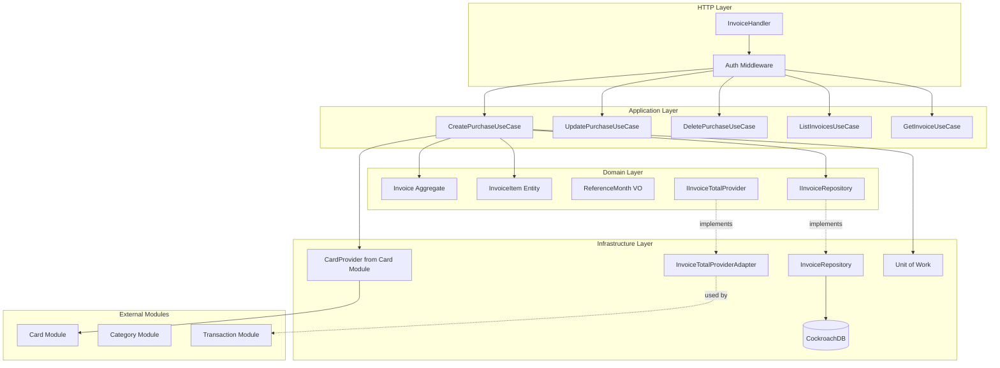
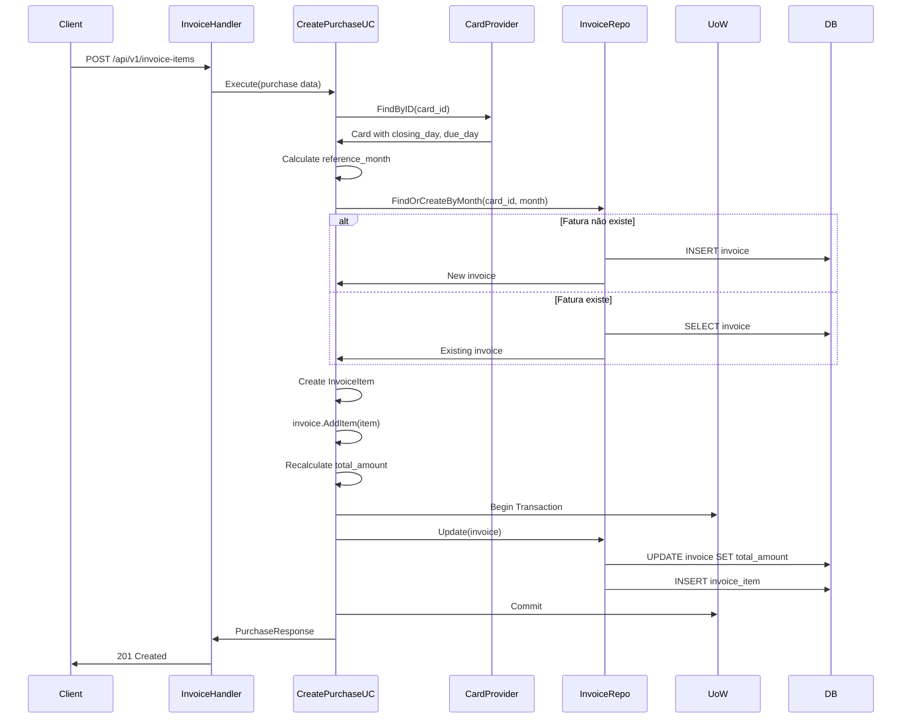
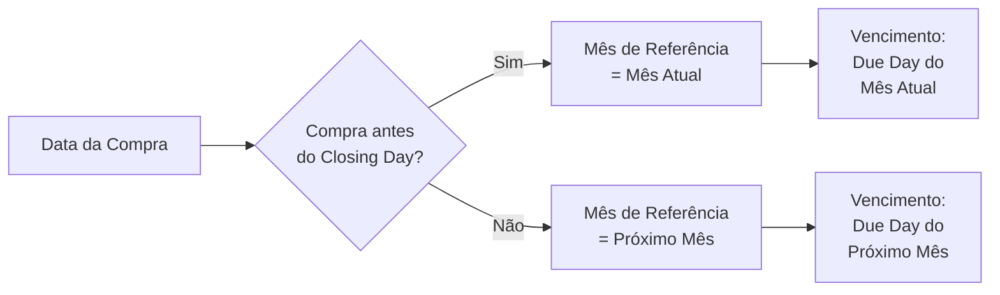

# Invoice Module

Módulo responsável pelo gerenciamento de faturas de cartões de crédito e suas compras (invoice items).

## Visão Geral

O módulo Invoice gerencia faturas mensais de cartões de crédito, agrupando compras (invoice items) por mês de referência. As faturas são geradas automaticamente quando compras são registradas e calculam o total a pagar. Integra-se com os módulos Card e Category.

## Arquitetura



### Fluxo de Criação de Compra



### Cálculo de Mês de Referência



**Exemplo:**
- Card: closing_day = 8, due_day = 15
- Compra em 05/01: ref_month = 01/2026, due_date = 15/01
- Compra em 10/01: ref_month = 02/2026, due_date = 15/02

## Estrutura do Módulo

```
internal/invoice/
├── application/
│   ├── dtos/
│   │   └── invoice.go           # DTOs de request/response
│   └── usecase/
│       ├── create_purchase.go   # Criar compra (invoice item)
│       ├── update_purchase.go   # Atualizar compra
│       ├── delete_purchase.go   # Deletar compra
│       ├── list_invoices.go     # Listar faturas
│       └── get_invoice.go       # Buscar fatura específica
├── domain/
│   ├── entities/
│   │   ├── invoice.go           # Invoice aggregate root
│   │   └── invoice_item.go      # InvoiceItem entity
│   ├── vos/
│   │   └── reference_month.go   # Value Object: Mês de referência
│   └── interfaces/
│       ├── invoice_repository.go         # Contrato de persistência
│       └── invoice_total_provider.go     # Provider para Transaction module
├── infrastructure/
│   ├── adapters/
│   │   └── invoice_total_provider_adapter.go # Adapter para exportar totais
│   ├── http/
│   │   ├── invoice_handler.go   # HTTP handlers
│   │   └── invoice_routes.go    # Registro de rotas
│   └── repositories/
│       └── invoice_repository.go # Implementação do repositório
└── module.go                    # Setup, DI e Unit of Work
```

## API Endpoints

Todos os endpoints requerem autenticação via Bearer token.

### 1. Create Purchase (Invoice Item)

Cria uma nova compra no cartão de crédito.

```http
POST /api/v1/invoice-items
Authorization: Bearer {token}
Content-Type: application/json
```

**Request Body:**
```json
{
  "card_id": "550e8400-e29b-41d4-a716-446655440000",
  "description": "Netflix mensalidade",
  "amount": 49.90,
  "purchase_date": "2026-01-15",
  "payment_method_id": "22222222-2222-2222-2222-222222222222",
  "category_id": "770e8400-e29b-41d4-a716-446655440000"
}
```

**Success Response (201 Created):**
```json
{
  "data": {
    "id": "880e8400-e29b-41d4-a716-446655440000",
    "invoice_id": "990e8400-e29b-41d4-a716-446655440000",
    "description": "Netflix mensalidade",
    "amount": 49.90,
    "purchase_date": "2026-01-15T00:00:00Z",
    "payment_method_id": "22222222-2222-2222-2222-222222222222",
    "category_id": "770e8400-e29b-41d4-a716-446655440000",
    "created_at": "2026-01-15T10:00:00Z",
    "updated_at": "2026-01-15T10:00:00Z"
  }
}
```

**Error Responses:**
- `400 Bad Request` - Dados inválidos (amount negativo, datas inválidas)
- `404 Not Found` - Card, category ou payment_method não encontrado

### 2. Update Purchase

Atualiza uma compra existente.

```http
PUT /api/v1/invoice-items/{id}
Authorization: Bearer {token}
Content-Type: application/json
```

**Request Body:**
```json
{
  "description": "Netflix Premium",
  "amount": 59.90,
  "category_id": "770e8400-e29b-41d4-a716-446655440000"
}
```

**Success Response (200 OK):**
```json
{
  "data": {
    "id": "880e8400-e29b-41d4-a716-446655440000",
    "invoice_id": "990e8400-e29b-41d4-a716-446655440000",
    "description": "Netflix Premium",
    "amount": 59.90,
    "purchase_date": "2026-01-15T00:00:00Z",
    "payment_method_id": "22222222-2222-2222-2222-222222222222",
    "category_id": "770e8400-e29b-41d4-a716-446655440000",
    "created_at": "2026-01-15T10:00:00Z",
    "updated_at": "2026-01-15T11:30:00Z"
  }
}
```

**Observação:** Atualização recalcula automaticamente o `total_amount` da fatura.

**Error Responses:**
- `400 Bad Request` - Dados inválidos
- `404 Not Found` - Purchase não encontrada

### 3. Delete Purchase

Remove uma compra (soft delete).

```http
DELETE /api/v1/invoice-items/{id}
Authorization: Bearer {token}
```

**Success Response (204 No Content)**

**Observação:** Remoção recalcula automaticamente o `total_amount` da fatura.

**Error Responses:**
- `404 Not Found` - Purchase não encontrada

### 4. List Invoices

Lista faturas do usuário com filtros opcionais.

```http
GET /api/v1/invoices?month=2026-01&cardId={uuid}&limit=20&cursor=eyJm...
Authorization: Bearer {token}
```

**Query Parameters:**
- `month` (opcional): Filtrar por mês de referência (formato: YYYY-MM)
- `cardId` (opcional): Filtrar por cartão específico
- `limit` (opcional): Número de resultados (default: 20, max: 100)
- `cursor` (opcional): Token de paginação

**Success Response (200 OK):**
```json
{
  "data": [
    {
      "id": "990e8400-e29b-41d4-a716-446655440000",
      "user_id": "660e8400-e29b-41d4-a716-446655440000",
      "card_id": "550e8400-e29b-41d4-a716-446655440000",
      "reference_month": "2026-01",
      "due_date": "2026-02-15",
      "total_amount": 1250.50,
      "items_count": 15,
      "created_at": "2026-01-01T00:00:00Z",
      "updated_at": "2026-01-30T10:00:00Z"
    }
  ],
  "pagination": {
    "limit": 20,
    "has_next": true,
    "next_cursor": "eyJmaWVsZHMi..."
  }
}
```

### 5. Get Invoice

Busca uma fatura específica com todos os items.

```http
GET /api/v1/invoices/{id}
Authorization: Bearer {token}
```

**Success Response (200 OK):**
```json
{
  "data": {
    "id": "990e8400-e29b-41d4-a716-446655440000",
    "user_id": "660e8400-e29b-41d4-a716-446655440000",
    "card_id": "550e8400-e29b-41d4-a716-446655440000",
    "reference_month": "2026-01",
    "due_date": "2026-02-15",
    "total_amount": 1250.50,
    "items": [
      {
        "id": "880e8400-e29b-41d4-a716-446655440000",
        "description": "Netflix Premium",
        "amount": 59.90,
        "purchase_date": "2026-01-15",
        "category_id": "770e8400-e29b-41d4-a716-446655440000",
        "category_name": "Streaming"
      },
      {
        "id": "881e8400-e29b-41d4-a716-446655440000",
        "description": "Supermercado",
        "amount": 350.00,
        "purchase_date": "2026-01-20",
        "category_id": "771e8400-e29b-41d4-a716-446655440000",
        "category_name": "Alimentação"
      }
    ],
    "created_at": "2026-01-01T00:00:00Z",
    "updated_at": "2026-01-30T10:00:00Z"
  }
}
```

**Error Responses:**
- `404 Not Found` - Fatura não encontrada

## Domain Model

### Invoice (Aggregate Root)

```go
type Invoice struct {
    ID             uuid.UUID
    UserID         uuid.UUID
    CardID         uuid.UUID
    ReferenceMonth ReferenceMonth  // YYYY-MM
    DueDate        time.Time
    TotalAmount    Money
    Items          []*InvoiceItem
    CreatedAt      time.Time
    UpdatedAt      time.Time
    DeletedAt      *time.Time
}
```

**Business Methods:**
```go
func (inv *Invoice) AddItem(item *InvoiceItem) error
func (inv *Invoice) AddItems(items []*InvoiceItem) error
func (inv *Invoice) RemoveItem(itemID uuid.UUID) error
func (inv *Invoice) UpdateItem(itemID uuid.UUID, updates *InvoiceItem) error
func (inv *Invoice) recalculateTotalAmount()
```

**Invariantes:**
- `TotalAmount` sempre reflete soma dos items
- Não pode ter items com amount negativo
- `ReferenceMonth` é imutável após criação

### InvoiceItem (Entity)

```go
type InvoiceItem struct {
    ID              uuid.UUID
    InvoiceID       uuid.UUID
    Description     string
    Amount          Money
    PurchaseDate    time.Time
    PaymentMethodID uuid.UUID
    CategoryID      *uuid.UUID  // Opcional
    CreatedAt       time.Time
    UpdatedAt       time.Time
    DeletedAt       *time.Time
}
```

**Validações:**
- `Amount` deve ser > 0
- `Description` não pode ser vazio
- `PurchaseDate` deve estar no passado ou hoje

### Value Objects

#### ReferenceMonth

```go
type ReferenceMonth struct {
    value time.Time  // Normalizado para primeiro dia do mês
}
```

**Formato:** `YYYY-MM`

**Métodos:**
```go
func NewReferenceMonth(date time.Time) ReferenceMonth
func (rm ReferenceMonth) String() string // "2026-01"
func (rm ReferenceMonth) FirstDay() time.Time // 2026-01-01
func (rm ReferenceMonth) LastDay() time.Time // 2026-01-31
```

## Business Rules

### 1. Cálculo de Reference Month

**Regra:** Compras são alocadas ao mês com base no closing day do cartão

```go
if purchaseDay <= card.ClosingDay {
    referenceMonth = currentMonth
} else {
    referenceMonth = nextMonth
}
```

**Exemplo com closing_day = 8:**
| Data Compra | Closing Day | Reference Month | Vencimento (due_day=15) |
|-------------|-------------|-----------------|-------------------------|
| 05/01/2026 | 8 | 01/2026 | 15/01/2026 |
| 08/01/2026 | 8 | 01/2026 | 15/01/2026 |
| 09/01/2026 | 8 | 02/2026 | 15/02/2026 |
| 25/01/2026 | 8 | 02/2026 | 15/02/2026 |

### 2. Cálculo de Due Date

```go
dueDate = Date(referenceMonth.Year, referenceMonth.Month, card.DueDay)
```

### 3. Recalcular Total Amount

Sempre que items são adicionados, removidos ou atualizados:

```go
totalAmount = sum(item.Amount for item in items where deleted_at is null)
```

### 4. Unit of Work

Operações que modificam invoice + items usam transação:
- Create purchase: INSERT invoice + INSERT item (se fatura nova)
- Update purchase: UPDATE item + UPDATE invoice.total_amount
- Delete purchase: UPDATE item.deleted_at + UPDATE invoice.total_amount

## Database Schema

```sql
CREATE TABLE invoices (
    id UUID PRIMARY KEY DEFAULT gen_random_uuid(),
    user_id UUID NOT NULL REFERENCES users(id),
    card_id UUID NOT NULL REFERENCES cards(id),
    reference_month DATE NOT NULL,
    due_date DATE NOT NULL,
    total_amount NUMERIC(19,2) NOT NULL DEFAULT 0,
    created_at TIMESTAMPTZ NOT NULL DEFAULT NOW(),
    updated_at TIMESTAMPTZ NOT NULL DEFAULT NOW(),
    deleted_at TIMESTAMPTZ
);

CREATE TABLE invoice_items (
    id UUID PRIMARY KEY DEFAULT gen_random_uuid(),
    invoice_id UUID NOT NULL REFERENCES invoices(id),
    description VARCHAR(500) NOT NULL,
    amount NUMERIC(19,2) NOT NULL CHECK (amount > 0),
    purchase_date DATE NOT NULL,
    payment_method_id UUID NOT NULL REFERENCES payment_methods(id),
    category_id UUID REFERENCES categories(id),
    created_at TIMESTAMPTZ NOT NULL DEFAULT NOW(),
    updated_at TIMESTAMPTZ NOT NULL DEFAULT NOW(),
    deleted_at TIMESTAMPTZ
);

-- Indexes
CREATE INDEX idx_invoices_user_card ON invoices(user_id, card_id) WHERE deleted_at IS NULL;
CREATE INDEX idx_invoices_reference_month ON invoices(reference_month) WHERE deleted_at IS NULL;
CREATE INDEX idx_invoice_items_invoice_id ON invoice_items(invoice_id) WHERE deleted_at IS NULL;
CREATE INDEX idx_invoice_items_category_id ON invoice_items(category_id) WHERE deleted_at IS NULL;

-- Unique constraint: Uma fatura por cartão por mês
CREATE UNIQUE INDEX idx_invoices_unique_card_month
    ON invoices(card_id, reference_month)
    WHERE deleted_at IS NULL;
```

## Métricas

**Status:** Não implementadas

O módulo Invoice atualmente não possui métricas customizadas. As seguintes métricas são candidatas para implementação futura:

### Métricas Sugeridas

- `financial_invoice_operations_total` - Total de operações (create/update/delete purchase)
- `financial_invoice_errors_total` - Total de erros por tipo
- `financial_invoice_operation_duration_seconds` - Latência de operações
- `financial_invoice_total_amount` - Valor total das faturas (gauge por mês)
- `financial_invoice_items_total` - Total de compras registradas
- `financial_invoice_average_amount` - Ticket médio por fatura

### PromQL Queries (Futuras)

```promql
# Compras registradas por minuto
rate(financial_invoice_operations_total{operation="create_purchase"}[1m])

# Valor total faturado (mês atual)
sum(financial_invoice_total_amount{reference_month="2026-01"})

# Ticket médio
financial_invoice_total_amount / financial_invoice_items_total

# P95 latência de criação de compra
histogram_quantile(0.95,
  sum(rate(financial_invoice_operation_duration_seconds_bucket{operation="create_purchase"}[5m])) by (le)
)
```

## Interfaces de Domínio

### IInvoiceRepository

```go
type IInvoiceRepository interface {
    Create(ctx context.Context, invoice *entities.Invoice) error
    Update(ctx context.Context, invoice *entities.Invoice) error
    Delete(ctx context.Context, id uuid.UUID) error
    FindByID(ctx context.Context, id uuid.UUID) (*entities.Invoice, error)
    FindByCardAndMonth(ctx context.Context, cardID uuid.UUID, month time.Time) (*entities.Invoice, error)
    FindByUserAndMonth(ctx context.Context, userID uuid.UUID, month time.Time) ([]*entities.Invoice, error)
    FindPaginated(ctx context.Context, userID uuid.UUID, filters map[string]interface{}, limit int, cursor string) ([]*entities.Invoice, bool, string, error)

    // Invoice Item operations
    CreateItem(ctx context.Context, item *entities.InvoiceItem) error
    UpdateItem(ctx context.Context, item *entities.InvoiceItem) error
    DeleteItem(ctx context.Context, id uuid.UUID) error
    FindItemByID(ctx context.Context, id uuid.UUID) (*entities.InvoiceItem, error)
}
```

### IInvoiceTotalProvider (Interface Exportada)

```go
type IInvoiceTotalProvider interface {
    GetTotalByCardAndMonth(ctx context.Context, cardID uuid.UUID, month time.Time) (float64, error)
}
```

**Uso:** Permite que o módulo Transaction consulte totais de faturas para cálculo de gastos mensais.

## Use Cases

### 1. CreatePurchaseUseCase

**Responsabilidade:** Criar compra e associar à fatura correta

**Fluxo:**
1. Validar dados de entrada
2. Buscar card para obter closing_day e due_day
3. Calcular reference_month baseado na purchase_date
4. Buscar ou criar invoice para o mês
5. Criar InvoiceItem
6. Adicionar item à invoice (recalcula total)
7. Persistir com Unit of Work

**Unit of Work:** Sim (garante consistência invoice + item)

### 2. UpdatePurchaseUseCase

**Responsabilidade:** Atualizar compra existente

**Fluxo:**
1. Buscar item por ID
2. Atualizar campos
3. Recalcular total da invoice
4. Persistir com Unit of Work

**Unit of Work:** Sim

### 3. DeletePurchaseUseCase

**Responsabilidade:** Soft delete de compra

**Fluxo:**
1. Buscar item por ID
2. Soft delete item
3. Recalcular total da invoice
4. Persistir com Unit of Work

**Unit of Work:** Sim

### 4. ListInvoicesUseCase

**Responsabilidade:** Listar faturas com filtros e paginação

**Filtros:**
- Por mês de referência
- Por cartão
- Por usuário (implícito via auth)

### 5. GetInvoiceUseCase

**Responsabilidade:** Buscar fatura com todos os items

**Inclui:** Items com categoria e payment method (eager loading)

## Integration

### CardProvider (Dependency)

```go
// Usado para obter dados do cartão
cardProvider.FindByID(ctx, cardID)
```

**Dados necessários:**
- `closing_day` - Para calcular reference_month
- `due_day` - Para calcular due_date

### InvoiceTotalProvider (Export)

```go
// Transaction module usa para obter totais de fatura
invoiceTotalProvider.GetTotalByCardAndMonth(ctx, cardID, month)
```

**Retorna:** Total da fatura para o mês especificado

## Dependências

### Externas
- `github.com/JailtonJunior94/devkit-go` - UoW, Money VO, Entity base
- `github.com/google/uuid` - UUID generation

### Internas
- `internal/card` - CardProvider para dados do cartão
- `pkg/pagination` - Cursor-based pagination
- `pkg/custom_errors` - Domain errors
- `pkg/api/http` - HTTP response utilities

### Módulos que Dependem do Invoice
- **Transaction Module** - Usa InvoiceTotalProvider

## Testing

### Unit Tests

```bash
go test ./internal/invoice/... -v
go test ./internal/invoice/... -cover
```

### Integration Tests

```bash
go test -tags=integration ./internal/invoice/... -v
```

### Test Cases Importantes

1. **Reference Month Calculation**
   - Compra antes do closing_day → mês atual
   - Compra após closing_day → próximo mês
   - Compra no closing_day → mês atual

2. **Total Recalculation**
   - Adicionar item → total incrementa
   - Remover item → total decrementa
   - Atualizar amount → total recalcula

3. **Unit of Work**
   - Rollback em caso de erro
   - Commit apenas se todas as operações sucederem

## Usage Examples

### cURL Examples

**Create Purchase:**
```bash
curl -X POST http://localhost:8000/api/v1/invoice-items \
  -H "Authorization: Bearer $TOKEN" \
  -H "Content-Type: application/json" \
  -d '{
    "card_id": "550e8400-e29b-41d4-a716-446655440000",
    "description": "Netflix",
    "amount": 49.90,
    "purchase_date": "2026-01-15",
    "payment_method_id": "22222222-2222-2222-2222-222222222222",
    "category_id": "770e8400-e29b-41d4-a716-446655440000"
  }'
```

**List Invoices by Month:**
```bash
curl -X GET "http://localhost:8000/api/v1/invoices?month=2026-01" \
  -H "Authorization: Bearer $TOKEN"
```

**Get Invoice Details:**
```bash
curl -X GET http://localhost:8000/api/v1/invoices/{id} \
  -H "Authorization: Bearer $TOKEN"
```

**Update Purchase:**
```bash
curl -X PUT http://localhost:8000/api/v1/invoice-items/{id} \
  -H "Authorization: Bearer $TOKEN" \
  -H "Content-Type: application/json" \
  -d '{
    "description": "Netflix Premium",
    "amount": 59.90
  }'
```

**Delete Purchase:**
```bash
curl -X DELETE http://localhost:8000/api/v1/invoice-items/{id} \
  -H "Authorization: Bearer $TOKEN"
```

## Best Practices

### Aggregate Consistency

**Invoice é um Aggregate Root:**
- Sempre modificar items através da Invoice
- Usar métodos `AddItem`, `RemoveItem`, `UpdateItem`
- Recalcular total automaticamente

```go
// ✅ Correto
invoice.AddItem(newItem)
repository.Update(invoice)

// ❌ Incorreto
repository.CreateItem(newItem)  // Bypassa aggregate
```

### Unit of Work Usage

```go
err := uow.Do(ctx, func(uow *unitofwork.UoW) error {
    // Múltiplas operações na mesma transação
    if err := repo.Update(invoice); err != nil {
        return err
    }
    if err := repo.UpdateItem(item); err != nil {
        return err
    }
    return nil
})
```

### Error Handling

```go
// Invoice not found
custom_errors.NewNotFoundError("invoice", invoiceID)

// Item not found
custom_errors.NewNotFoundError("invoice_item", itemID)

// Invalid amount
custom_errors.NewValidationError(map[string][]string{
    "amount": {"amount must be greater than 0"},
})

// Card not found (dependency)
custom_errors.NewNotFoundError("card", cardID)
```

## Roadmap

### Futuras Implementações

- [ ] Implementar métricas customizadas
- [ ] Parcelamento de compras
- [ ] Desconto/cashback em compras
- [ ] Compras recorrentes (assinaturas)
- [ ] Anexos de nota fiscal
- [ ] Tags personalizadas
- [ ] Compartilhamento de compras (split)
- [ ] Notificação de vencimento
- [ ] Exportação de fatura (PDF)
- [ ] Integração com e-mail de fatura

## Referências

- [Aggregate Pattern](https://martinfowler.com/bliki/DDD_Aggregate.html)
- [Unit of Work Pattern](https://martinfowler.com/eaaCatalog/unitOfWork.html)
- [Brazilian Credit Card System](https://www.bcb.gov.br/estabilidadefinanceira/cartoes)
