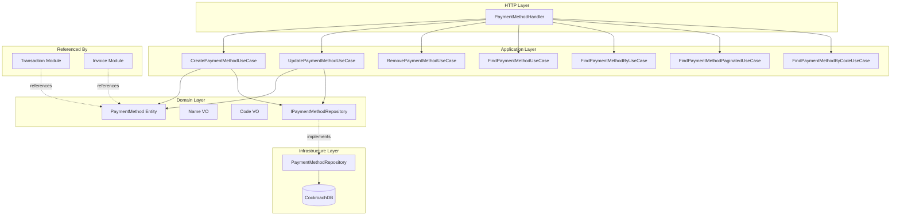
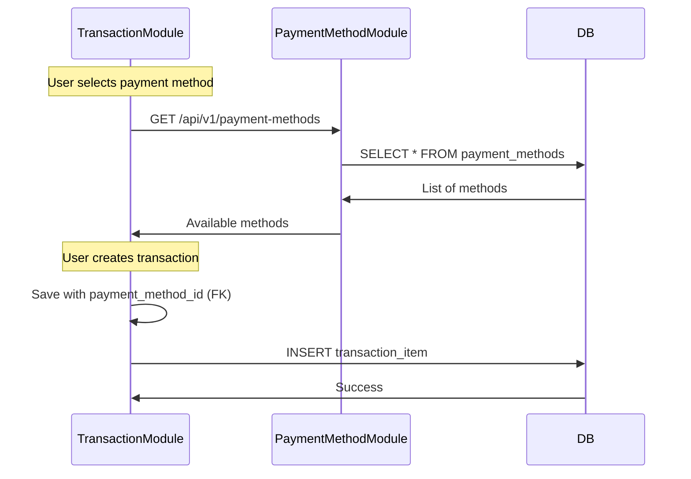

# Payment Method Module

Módulo responsável pelo gerenciamento de métodos de pagamento globais do sistema.

## Visão Geral

O módulo Payment Method gerencia os tipos de pagamento disponíveis no sistema (PIX, Cartão de Crédito, Boleto, etc.). É um módulo de domínio global, não associado a usuários específicos, servindo como tabela de referência para outros módulos.

## Arquitetura



### Fluxo de Uso



## Estrutura do Módulo

```
internal/payment_method/
├── application/
│   ├── dtos/
│   │   └── payment_method.go    # DTOs de request/response
│   └── usecase/
│       ├── create.go            # Criar método de pagamento
│       ├── update.go            # Atualizar método
│       ├── remove.go            # Remover método (soft delete)
│       ├── find.go              # Listar todos
│       ├── find_by.go           # Buscar por ID
│       ├── find_by_code.go      # Buscar por código
│       └── find_paginated.go    # Listagem paginada
├── domain/
│   ├── entities/
│   │   └── payment_method.go    # PaymentMethod entity
│   ├── vos/
│   │   ├── name.go              # Value Object: Nome
│   │   └── code.go              # Value Object: Código
│   └── interfaces/
│       └── payment_method_repository.go # Contrato de persistência
├── infrastructure/
│   ├── http/
│   │   ├── payment_method_handler.go    # HTTP handlers
│   │   └── payment_method_routes.go     # Registro de rotas
│   └── repositories/
│       └── payment_method_repository.go # Implementação do repositório
└── module.go                    # Setup e DI do módulo
```

## API Endpoints

**Observação:** Endpoints **não requerem autenticação** pois são dados globais do sistema.

### 1. List Payment Methods (Paginated)

Lista métodos de pagamento com paginação cursor-based.

```http
GET /api/v1/payment-methods?limit=20&cursor=eyJm...
```

**Query Parameters:**
- `limit` (opcional): Número de resultados (default: 20, max: 100)
- `cursor` (opcional): Token de paginação
- `code` (opcional): Filtrar por código específico

**Success Response (200 OK):**
```json
{
  "data": [
    {
      "id": "550e8400-e29b-41d4-a716-446655440000",
      "name": "PIX",
      "code": "PIX",
      "description": "Pagamento instantâneo PIX",
      "created_at": "2026-01-01T00:00:00Z",
      "updated_at": "2026-01-01T00:00:00Z"
    },
    {
      "id": "660e8400-e29b-41d4-a716-446655440000",
      "name": "Cartão de Crédito",
      "code": "CREDIT_CARD",
      "description": "Pagamento via cartão de crédito",
      "created_at": "2026-01-01T00:00:00Z",
      "updated_at": "2026-01-01T00:00:00Z"
    }
  ],
  "pagination": {
    "limit": 20,
    "has_next": false,
    "next_cursor": null
  }
}
```

### 2. Get Payment Method by ID

Busca um método de pagamento específico por ID.

```http
GET /api/v1/payment-methods/{id}
```

**Success Response (200 OK):**
```json
{
  "data": {
    "id": "550e8400-e29b-41d4-a716-446655440000",
    "name": "PIX",
    "code": "PIX",
    "description": "Pagamento instantâneo PIX",
    "created_at": "2026-01-01T00:00:00Z",
    "updated_at": "2026-01-01T00:00:00Z"
  }
}
```

**Error Responses:**
- `404 Not Found` - Método de pagamento não encontrado

### 3. Get Payment Method by Code

Busca um método de pagamento por código.

```http
GET /api/v1/payment-methods?code=PIX
```

**Success Response (200 OK):**
```json
{
  "data": [
    {
      "id": "550e8400-e29b-41d4-a716-446655440000",
      "name": "PIX",
      "code": "PIX",
      "description": "Pagamento instantâneo PIX",
      "created_at": "2026-01-01T00:00:00Z",
      "updated_at": "2026-01-01T00:00:00Z"
    }
  ],
  "pagination": {
    "limit": 20,
    "has_next": false,
    "next_cursor": null
  }
}
```

### 4. Create Payment Method

Cria um novo método de pagamento.

```http
POST /api/v1/payment-methods
Content-Type: application/json
```

**Request Body:**
```json
{
  "name": "PayPal",
  "code": "PAYPAL",
  "description": "Pagamento via PayPal"
}
```

**Success Response (201 Created):**
```json
{
  "data": {
    "id": "770e8400-e29b-41d4-a716-446655440000",
    "name": "PayPal",
    "code": "PAYPAL",
    "description": "Pagamento via PayPal",
    "created_at": "2026-01-30T10:00:00Z",
    "updated_at": "2026-01-30T10:00:00Z"
  }
}
```

**Error Responses:**
- `400 Bad Request` - Dados inválidos
- `409 Conflict` - Código já existe

### 5. Update Payment Method

Atualiza informações de um método de pagamento.

```http
PUT /api/v1/payment-methods/{id}
Content-Type: application/json
```

**Request Body:**
```json
{
  "name": "PIX - Pagamento Instantâneo",
  "code": "PIX",
  "description": "Sistema de pagamento instantâneo brasileiro"
}
```

**Success Response (200 OK):**
```json
{
  "data": {
    "id": "550e8400-e29b-41d4-a716-446655440000",
    "name": "PIX - Pagamento Instantâneo",
    "code": "PIX",
    "description": "Sistema de pagamento instantâneo brasileiro",
    "created_at": "2026-01-01T00:00:00Z",
    "updated_at": "2026-01-30T11:30:00Z"
  }
}
```

**Error Responses:**
- `400 Bad Request` - Dados inválidos
- `404 Not Found` - Método não encontrado
- `409 Conflict` - Código já existe em outro registro

### 6. Delete Payment Method

Remove um método de pagamento (soft delete).

```http
DELETE /api/v1/payment-methods/{id}
```

**Success Response (204 No Content)**

**Error Responses:**
- `404 Not Found` - Método não encontrado
- `409 Conflict` - Método está sendo usado em transações/faturas

## Domain Model

### PaymentMethod Entity

```go
type PaymentMethod struct {
    ID          uuid.UUID
    Name        Name
    Code        Code
    Description *string  // Opcional
    CreatedAt   time.Time
    UpdatedAt   time.Time
    DeletedAt   *time.Time
}
```

**Características:**
- Não possui `user_id` (dado global)
- `code` deve ser único
- `description` é opcional

### Value Objects

#### Name

```go
type Name struct {
    value string
}
```

**Validações:**
- Não pode ser vazio
- Comprimento máximo: 255 caracteres
- Trim de espaços em branco

#### Code

```go
type Code struct {
    value string
}
```

**Validações:**
- Não pode ser vazio
- Apenas letras maiúsculas e underscore (A-Z, _)
- Comprimento máximo: 50 caracteres
- Único no sistema

**Exemplos válidos:**
- `PIX`
- `CREDIT_CARD`
- `BANK_TRANSFER`
- `BOLETO`

## Métodos de Pagamento Padrão

### Métodos Pré-configurados

| Code | Name | Description |
|------|------|-------------|
| `PIX` | PIX | Pagamento instantâneo brasileiro |
| `CREDIT_CARD` | Cartão de Crédito | Pagamento via cartão de crédito |
| `DEBIT_CARD` | Cartão de Débito | Pagamento via cartão de débito |
| `BOLETO` | Boleto Bancário | Boleto para pagamento em banco |
| `BANK_TRANSFER` | Transferência Bancária | TED/DOC |
| `CASH` | Dinheiro | Pagamento em espécie |

### Seed Data (Migration)

```sql
INSERT INTO payment_methods (id, name, code, description) VALUES
  ('11111111-1111-1111-1111-111111111111', 'PIX', 'PIX', 'Pagamento instantâneo brasileiro'),
  ('22222222-2222-2222-2222-222222222222', 'Cartão de Crédito', 'CREDIT_CARD', 'Pagamento via cartão de crédito'),
  ('33333333-3333-3333-3333-333333333333', 'Cartão de Débito', 'DEBIT_CARD', 'Pagamento via cartão de débito'),
  ('44444444-4444-4444-4444-444444444444', 'Boleto Bancário', 'BOLETO', 'Boleto para pagamento em banco'),
  ('55555555-5555-5555-5555-555555555555', 'Transferência Bancária', 'BANK_TRANSFER', 'TED/DOC'),
  ('66666666-6666-6666-6666-666666666666', 'Dinheiro', 'CASH', 'Pagamento em espécie');
```

## Database Schema

```sql
CREATE TABLE payment_methods (
    id UUID PRIMARY KEY DEFAULT gen_random_uuid(),
    name VARCHAR(255) NOT NULL,
    code VARCHAR(50) NOT NULL UNIQUE,
    description VARCHAR(500),
    created_at TIMESTAMPTZ NOT NULL DEFAULT NOW(),
    updated_at TIMESTAMPTZ NOT NULL DEFAULT NOW(),
    deleted_at TIMESTAMPTZ
);

CREATE INDEX idx_payment_methods_code ON payment_methods(code) WHERE deleted_at IS NULL;
CREATE INDEX idx_payment_methods_deleted_at ON payment_methods(deleted_at);
```

**Observações:**
- Sem `user_id` - tabela global
- `code` UNIQUE garante unicidade
- Index em `code` para busca rápida

## Métricas

**Status:** Não implementadas

O módulo Payment Method atualmente não possui métricas customizadas. As seguintes métricas são candidatas para implementação futura:

### Métricas Sugeridas

- `financial_payment_method_operations_total` - Total de operações por status
- `financial_payment_method_errors_total` - Total de erros por tipo
- `financial_payment_method_operation_duration_seconds` - Latência de operações
- `financial_payment_method_active_total` - Total de métodos ativos
- `financial_payment_method_usage_total` - Uso de cada método (referências)

### PromQL Queries (Futuras)

```promql
# Operações por segundo
rate(financial_payment_method_operations_total[5m])

# Métodos mais usados
topk(5, financial_payment_method_usage_total)

# Taxa de erro
sum(rate(financial_payment_method_operations_total{status="failure"}[5m]))
  /
sum(rate(financial_payment_method_operations_total[5m])) * 100
```

## Interfaces de Domínio

### IPaymentMethodRepository

```go
type IPaymentMethodRepository interface {
    Create(ctx context.Context, pm *entities.PaymentMethod) error
    Update(ctx context.Context, pm *entities.PaymentMethod) error
    Delete(ctx context.Context, id uuid.UUID) error
    FindAll(ctx context.Context) ([]*entities.PaymentMethod, error)
    FindByID(ctx context.Context, id uuid.UUID) (*entities.PaymentMethod, error)
    FindByCode(ctx context.Context, code string) (*entities.PaymentMethod, error)
    FindPaginated(ctx context.Context, limit int, cursor string) ([]*entities.PaymentMethod, bool, string, error)
    IsInUse(ctx context.Context, id uuid.UUID) (bool, error)
}
```

**Método Especial:**
- `IsInUse`: Verifica se método está referenciado em transações/faturas antes de deletar

## Use Cases

### 1. CreatePaymentMethodUseCase

**Responsabilidade:** Criar novo método de pagamento

**Validações:**
- Nome não vazio
- Code único
- Code formato válido (uppercase, underscore)

### 2. UpdatePaymentMethodUseCase

**Responsabilidade:** Atualizar método existente

**Validações:**
- Método existe
- Se mudando code, verificar unicidade
- Code formato válido

### 3. RemovePaymentMethodUseCase

**Responsabilidade:** Soft delete de método

**Validações:**
- Método existe
- Não está em uso (referências em outras tabelas)

### 4. FindPaymentMethodUseCase

**Responsabilidade:** Listar todos os métodos

**Ordenação:** Por created_at ASC

### 5. FindPaymentMethodByUseCase

**Responsabilidade:** Buscar método por ID

### 6. FindPaymentMethodByCodeUseCase

**Responsabilidade:** Buscar método por código

**Uso:** Útil para mapear códigos de APIs externas

### 7. FindPaymentMethodPaginatedUseCase

**Responsabilidade:** Listagem paginada cursor-based

## Integration

### Uso em Outros Módulos

**Transaction Module:**
```go
type TransactionItem struct {
    PaymentMethodID *uuid.UUID  // FK para payment_methods
    // ...
}
```

**Invoice Module:**
```go
type InvoiceItem struct {
    PaymentMethodID uuid.UUID  // FK para payment_methods
    // ...
}
```

### Como Integrar

```go
// 1. Listar métodos disponíveis
methods, err := paymentMethodUseCase.Execute(ctx)

// 2. Usuário seleciona método
selectedMethodID := methods[0].ID

// 3. Criar transação com método
transaction := &Transaction{
    PaymentMethodID: &selectedMethodID,
    // ...
}
```

## Dependências

### Externas
- `github.com/JailtonJunior94/devkit-go` - Database utilities
- `github.com/google/uuid` - UUID generation

### Internas
- `pkg/pagination` - Cursor-based pagination
- `pkg/custom_errors` - Domain errors
- `pkg/api/http` - HTTP response utilities

## Testing

### Unit Tests

```bash
# Run payment method module tests
go test ./internal/payment_method/... -v

# With coverage
go test ./internal/payment_method/... -cover
```

### Integration Tests

```bash
go test -tags=integration ./internal/payment_method/... -v
```

### Test Cases Importantes

1. **Code Uniqueness**
   - Criar método com code "PIX"
   - Tentar criar outro com mesmo code
   - Deve retornar erro de conflito

2. **In Use Validation**
   - Criar transação referenciando método
   - Tentar deletar método
   - Deve retornar erro de conflito

3. **Code Format Validation**
   - Tentar criar com code "pix-test"
   - Deve retornar erro de validação

## Usage Examples

### cURL Examples

**List Payment Methods:**
```bash
curl -X GET http://localhost:8000/api/v1/payment-methods
```

**Get by Code:**
```bash
curl -X GET "http://localhost:8000/api/v1/payment-methods?code=PIX"
```

**Create Payment Method:**
```bash
curl -X POST http://localhost:8000/api/v1/payment-methods \
  -H "Content-Type: application/json" \
  -d '{
    "name": "PayPal",
    "code": "PAYPAL",
    "description": "Pagamento via PayPal"
  }'
```

**Update Payment Method:**
```bash
curl -X PUT http://localhost:8000/api/v1/payment-methods/{id} \
  -H "Content-Type: application/json" \
  -d '{
    "name": "PIX - Pagamento Instantâneo",
    "code": "PIX",
    "description": "Sistema de pagamento instantâneo brasileiro"
  }'
```

**Delete Payment Method:**
```bash
curl -X DELETE http://localhost:8000/api/v1/payment-methods/{id}
```

## Best Practices

### Code Naming Convention

**Boas práticas:**
- Use UPPER_SNAKE_CASE
- Seja descritivo mas conciso
- Evite abreviações obscuras
- Use padrões internacionais quando possível

**Exemplos:**
```
✅ PIX
✅ CREDIT_CARD
✅ BANK_TRANSFER
✅ DIGITAL_WALLET

❌ pix (lowercase)
❌ CC (abreviação não clara)
❌ bank-transfer (hífen não permitido)
❌ DigitalWallet (CamelCase não permitido)
```

### Quando Criar Novos Métodos

**Criar novo método quando:**
- Novo tipo de pagamento é suportado
- Necessário diferenciar comportamento
- Relatórios precisam separar por método

**Não criar quando:**
- Apenas bandeira diferente (Visa vs Mastercard)
- Instituição diferente (Nubank vs Itaú)
- Variação do mesmo método

**Exemplo:**
```
✅ Criar: PIX, CREDIT_CARD, BOLETO (tipos diferentes)
❌ Criar: NUBANK_CARD, ITAU_CARD (usar CREDIT_CARD + card_id)
```

### Error Handling

```go
// Payment method not found
custom_errors.NewNotFoundError("payment_method", id)

// Code already exists
custom_errors.NewConflictError("payment method code already exists")

// In use (cannot delete)
custom_errors.NewConflictError("payment method is in use")

// Invalid code format
custom_errors.NewValidationError(map[string][]string{
    "code": {"code must be uppercase with underscores only"},
})
```

## Security Considerations

### Why No Authentication?

Payment methods são dados de **domínio global**, não sensíveis:
- Não contém informações de usuários
- Não expõe dados confidenciais
- Necessário para seleção em interfaces públicas
- Simplifica integração frontend

**Se houver necessidade de controle:**
- Adicionar autenticação apenas em POST/PUT/DELETE
- Manter GET público para listagem

## Roadmap

### Futuras Implementações

- [ ] Implementar métricas customizadas
- [ ] Ícones/imagens por método
- [ ] Suporte a múltiplos idiomas (i18n)
- [ ] Metadados customizados (JSON field)
- [ ] Atributos específicos (ex: permite parcelamento)
- [ ] Ordenação customizável
- [ ] Status ativo/inativo
- [ ] Taxas associadas ao método
- [ ] Limites por método

### Possíveis Extensões

**PaymentMethodConfig:**
```go
type PaymentMethodConfig struct {
    PaymentMethodID   uuid.UUID
    AllowsInstallments bool
    MaxInstallments   int
    Fee               decimal.Decimal
    Active            bool
}
```

**PaymentMethodAttribute:**
```go
type PaymentMethodAttribute struct {
    PaymentMethodID uuid.UUID
    Key            string
    Value          string
}
```

## Referências

- [Payment Methods Overview](https://en.wikipedia.org/wiki/Payment_system)
- [Brazilian PIX System](https://www.bcb.gov.br/estabilidadefinanceira/pix)
- [Payment Method Standards](https://www.iso.org/standard/70346.html)
