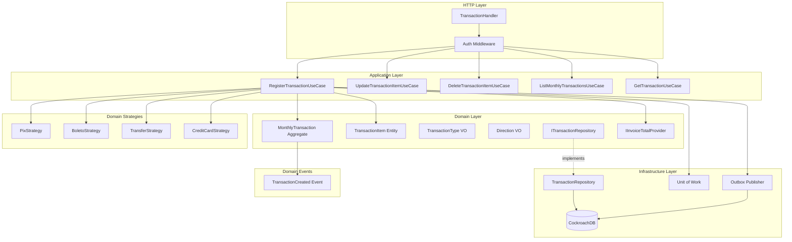
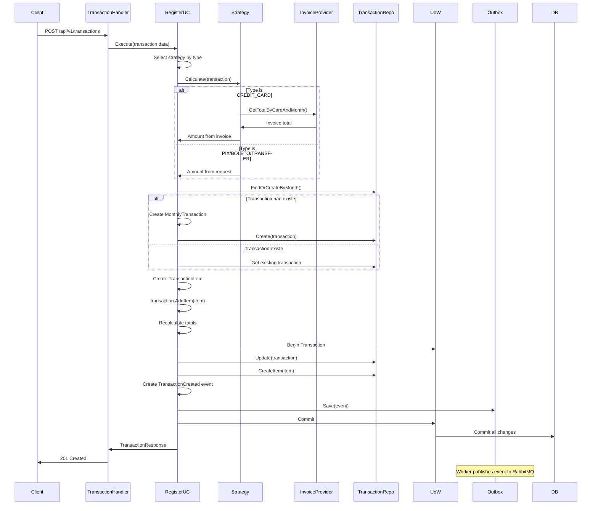
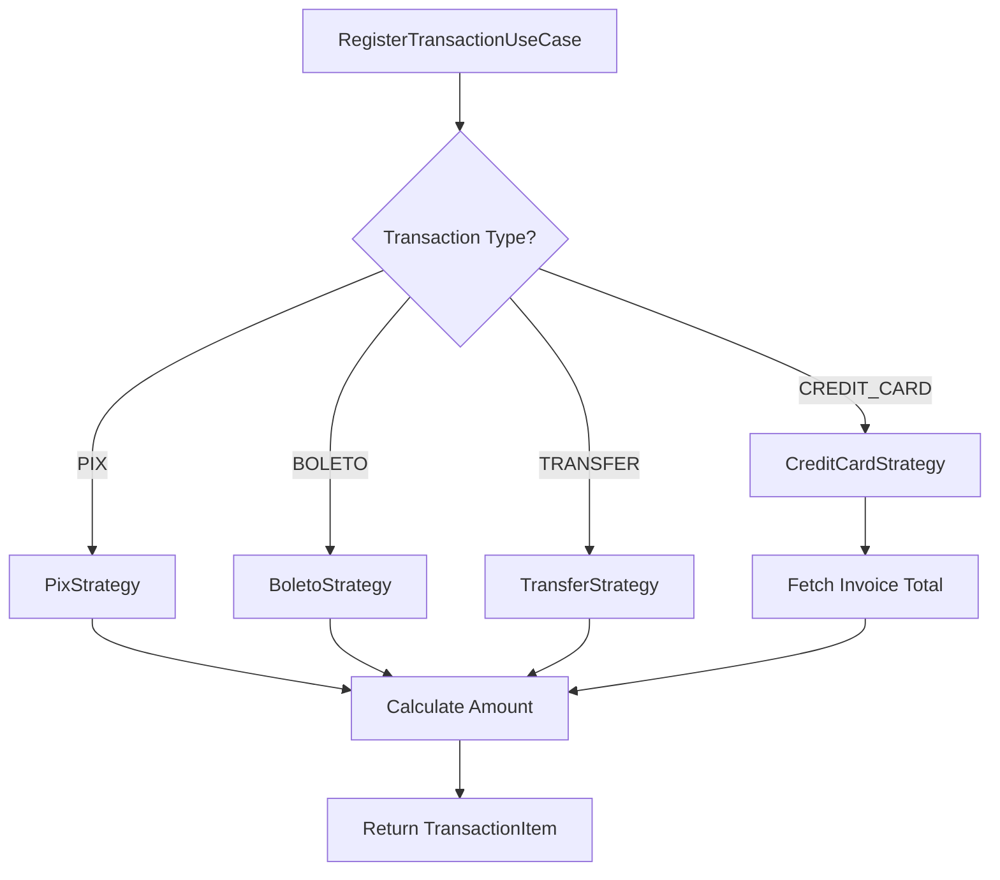

# Transaction Module

Módulo responsável pelo gerenciamento de transações financeiras mensais e seus itens.

## Visão Geral

O módulo Transaction gerencia transações financeiras agregadas por mês, incluindo receitas e despesas de diferentes tipos (PIX, Boleto, Transferência, Cartão de Crédito). Utiliza Strategy Pattern para lidar com diferentes tipos de transação e integra-se com Invoice module para incluir gastos de cartão de crédito.

## Arquitetura



### Fluxo de Registro de Transação



### Strategy Pattern



## Estrutura do Módulo

```
internal/transaction/
├── application/
│   ├── dtos/
│   │   └── transaction.go       # DTOs de request/response
│   └── usecase/
│       ├── register.go          # Registrar transação
│       ├── update_item.go       # Atualizar item
│       ├── delete_item.go       # Deletar item
│       ├── list_monthly.go      # Listar transações mensais
│       ├── list_monthly_paginated.go # Listagem paginada
│       └── get_monthly.go       # Buscar transação específica
├── domain/
│   ├── entities/
│   │   ├── monthly_transaction.go   # Aggregate root
│   │   └── transaction_item.go      # Transaction item entity
│   ├── vos/
│   │   ├── transaction_type.go      # PIX, BOLETO, TRANSFER, CREDIT_CARD
│   │   └── direction.go             # INCOME, EXPENSE
│   ├── events/
│   │   └── transaction_created.go   # Domain event
│   ├── strategies/
│   │   ├── strategy.go              # Strategy interface
│   │   ├── pix_strategy.go
│   │   ├── boleto_strategy.go
│   │   ├── transfer_strategy.go
│   │   └── credit_card_strategy.go
│   └── interfaces/
│       └── transaction_repository.go # Contrato de persistência
├── infrastructure/
│   ├── http/
│   │   ├── transaction_handler.go   # HTTP handlers
│   │   └── transaction_routes.go    # Registro de rotas
│   └── repositories/
│       └── transaction_repository.go # Implementação do repositório
└── module.go                        # Setup, DI, Strategies e UoW
```

## API Endpoints

Todos os endpoints requerem autenticação via Bearer token.

### 1. Register Transaction

Registra uma nova transação com itens.

```http
POST /api/v1/transactions
Authorization: Bearer {token}
Content-Type: application/json
```

**Request Body (PIX/BOLETO/TRANSFER):**
```json
{
  "reference_month": "2026-01",
  "items": [
    {
      "title": "Salário Janeiro",
      "amount": 5000.00,
      "direction": "INCOME",
      "type": "TRANSFER",
      "category_id": "770e8400-e29b-41d4-a716-446655440000"
    },
    {
      "title": "Aluguel",
      "amount": 1500.00,
      "direction": "EXPENSE",
      "type": "PIX",
      "category_id": "771e8400-e29b-41d4-a716-446655440000"
    }
  ]
}
```

**Request Body (CREDIT_CARD):**
```json
{
  "reference_month": "2026-01",
  "items": [
    {
      "title": "Fatura Nubank",
      "direction": "EXPENSE",
      "type": "CREDIT_CARD",
      "card_id": "550e8400-e29b-41d4-a716-446655440000",
      "category_id": "772e8400-e29b-41d4-a716-446655440000"
    }
  ]
}
```

**Observação:** Para `type: "CREDIT_CARD"`, o amount é buscado automaticamente da fatura via `InvoiceTotalProvider`.

**Success Response (201 Created):**
```json
{
  "data": {
    "id": "880e8400-e29b-41d4-a716-446655440000",
    "user_id": "660e8400-e29b-41d4-a716-446655440000",
    "reference_month": "2026-01",
    "total_income": 5000.00,
    "total_expense": 2750.50,
    "balance": 2249.50,
    "items": [
      {
        "id": "990e8400-e29b-41d4-a716-446655440000",
        "title": "Salário Janeiro",
        "amount": 5000.00,
        "direction": "INCOME",
        "type": "TRANSFER",
        "category_id": "770e8400-e29b-41d4-a716-446655440000"
      },
      {
        "id": "991e8400-e29b-41d4-a716-446655440000",
        "title": "Fatura Nubank",
        "amount": 1250.50,
        "direction": "EXPENSE",
        "type": "CREDIT_CARD",
        "card_id": "550e8400-e29b-41d4-a716-446655440000",
        "category_id": "772e8400-e29b-41d4-a716-446655440000"
      }
    ],
    "created_at": "2026-01-30T10:00:00Z",
    "updated_at": "2026-01-30T10:00:00Z"
  }
}
```

**Error Responses:**
- `400 Bad Request` - Dados inválidos (direction inválida, type inválido, amount negativo)
- `404 Not Found` - Card ou category não encontrado

### 2. List Monthly Transactions (Paginated)

Lista transações mensais do usuário com paginação.

```http
GET /api/v1/transactions?limit=20&cursor=eyJm...
Authorization: Bearer {token}
```

**Query Parameters:**
- `limit` (opcional): Número de resultados (default: 20, max: 100)
- `cursor` (opcional): Token de paginação

**Success Response (200 OK):**
```json
{
  "data": [
    {
      "id": "880e8400-e29b-41d4-a716-446655440000",
      "user_id": "660e8400-e29b-41d4-a716-446655440000",
      "reference_month": "2026-01",
      "total_income": 5000.00,
      "total_expense": 2750.50,
      "balance": 2249.50,
      "items_count": 5,
      "created_at": "2026-01-30T10:00:00Z",
      "updated_at": "2026-01-30T10:00:00Z"
    }
  ],
  "pagination": {
    "limit": 20,
    "has_next": false,
    "next_cursor": null
  }
}
```

### 3. Get Transaction by ID

Busca uma transação mensal específica com todos os itens.

```http
GET /api/v1/transactions/{id}
Authorization: Bearer {token}
```

**Success Response (200 OK):**
```json
{
  "data": {
    "id": "880e8400-e29b-41d4-a716-446655440000",
    "user_id": "660e8400-e29b-41d4-a716-446655440000",
    "reference_month": "2026-01",
    "total_income": 5000.00,
    "total_expense": 2750.50,
    "balance": 2249.50,
    "items": [
      {
        "id": "990e8400-e29b-41d4-a716-446655440000",
        "title": "Salário Janeiro",
        "amount": 5000.00,
        "direction": "INCOME",
        "type": "TRANSFER",
        "category_id": "770e8400-e29b-41d4-a716-446655440000",
        "category_name": "Salário"
      }
    ],
    "created_at": "2026-01-30T10:00:00Z",
    "updated_at": "2026-01-30T10:00:00Z"
  }
}
```

**Error Responses:**
- `404 Not Found` - Transação não encontrada

### 4. Update Transaction Item

Atualiza um item de transação existente.

```http
PUT /api/v1/transactions/{transactionId}/items/{itemId}
Authorization: Bearer {token}
Content-Type: application/json
```

**Request Body:**
```json
{
  "title": "Salário Janeiro Atualizado",
  "amount": 5500.00,
  "category_id": "770e8400-e29b-41d4-a716-446655440000"
}
```

**Success Response (200 OK):**
```json
{
  "data": {
    "id": "990e8400-e29b-41d4-a716-446655440000",
    "transaction_id": "880e8400-e29b-41d4-a716-446655440000",
    "title": "Salário Janeiro Atualizado",
    "amount": 5500.00,
    "direction": "INCOME",
    "type": "TRANSFER",
    "category_id": "770e8400-e29b-41d4-a716-446655440000",
    "created_at": "2026-01-30T10:00:00Z",
    "updated_at": "2026-01-30T11:30:00Z"
  }
}
```

**Observação:** Atualização recalcula automaticamente os totais da transação mensal.

**Error Responses:**
- `400 Bad Request` - Dados inválidos
- `404 Not Found` - Transaction ou item não encontrado

### 5. Delete Transaction Item

Remove um item de transação (soft delete).

```http
DELETE /api/v1/transactions/{transactionId}/items/{itemId}
Authorization: Bearer {token}
```

**Success Response (204 No Content)**

**Observação:** Remoção recalcula automaticamente os totais da transação mensal.

**Error Responses:**
- `404 Not Found` - Transaction ou item não encontrado

## Domain Model

### MonthlyTransaction (Aggregate Root)

```go
type MonthlyTransaction struct {
    ID             uuid.UUID
    UserID         uuid.UUID
    ReferenceMonth time.Time  // Normalizado para primeiro dia do mês
    TotalIncome    Money
    TotalExpense   Money
    Items          []*TransactionItem
    CreatedAt      time.Time
    UpdatedAt      time.Time
    DeletedAt      *time.Time
}
```

**Business Methods:**
```go
func (mt *MonthlyTransaction) AddItem(item *TransactionItem) error
func (mt *MonthlyTransaction) RemoveItem(itemID uuid.UUID) error
func (mt *MonthlyTransaction) UpdateItem(itemID uuid.UUID, updates *TransactionItem) error
func (mt *MonthlyTransaction) RecalculateTotals()
func (mt *MonthlyTransaction) Balance() Money
```

**Invariantes:**
- `TotalIncome` = soma de items com direction=INCOME
- `TotalExpense` = soma de items com direction=EXPENSE
- `Balance` = TotalIncome - TotalExpense

### TransactionItem (Entity)

```go
type TransactionItem struct {
    ID            uuid.UUID
    TransactionID uuid.UUID
    Title         string
    Amount        Money
    Direction     Direction      // INCOME, EXPENSE
    Type          TransactionType // PIX, BOLETO, TRANSFER, CREDIT_CARD
    CardID        *uuid.UUID     // Obrigatório se type=CREDIT_CARD
    CategoryID    *uuid.UUID     // Opcional
    CreatedAt     time.Time
    UpdatedAt     time.Time
    DeletedAt     *time.Time
}
```

**Validações:**
- `Amount` deve ser > 0
- `Title` não pode ser vazio
- Se `Type` = CREDIT_CARD, `CardID` é obrigatório
- `Direction` deve ser INCOME ou EXPENSE
- `Type` deve ser PIX, BOLETO, TRANSFER ou CREDIT_CARD

### Value Objects

#### Direction

```go
type Direction string

const (
    DirectionIncome  Direction = "INCOME"
    DirectionExpense Direction = "EXPENSE"
)
```

#### TransactionType

```go
type TransactionType string

const (
    TypePix         TransactionType = "PIX"
    TypeBoleto      TransactionType = "BOLETO"
    TypeTransfer    TransactionType = "TRANSFER"
    TypeCreditCard  TransactionType = "CREDIT_CARD"
)
```

### Domain Events

#### TransactionCreated

```go
type TransactionCreated struct {
    AggregateID    string
    TransactionID  string
    UserID         string
    ReferenceMonth string
    TotalIncome    float64
    TotalExpense   float64
    ItemsCount     int
    OccurredAt     time.Time
}
```

**Publicação:** Via Outbox Pattern para RabbitMQ

**Uso:** Pode ser consumido por outros serviços para analytics, notificações, etc.

## Strategy Pattern

### ITransactionStrategy

```go
type ITransactionStrategy interface {
    Calculate(ctx context.Context, request *TransactionItemRequest) (*TransactionItem, error)
}
```

### Estratégias Implementadas

#### 1. PixStrategy

**Comportamento:** Usa amount fornecido no request

```go
func (s *PixStrategy) Calculate(ctx context.Context, req *TransactionItemRequest) (*TransactionItem, error) {
    return &TransactionItem{
        Title:      req.Title,
        Amount:     req.Amount,
        Direction:  req.Direction,
        Type:       TypePix,
        CategoryID: req.CategoryID,
    }, nil
}
```

#### 2. BoletoStrategy

**Comportamento:** Usa amount fornecido no request

```go
func (s *BoletoStrategy) Calculate(ctx context.Context, req *TransactionItemRequest) (*TransactionItem, error) {
    return &TransactionItem{
        Title:      req.Title,
        Amount:     req.Amount,
        Direction:  req.Direction,
        Type:       TypeBoleto,
        CategoryID: req.CategoryID,
    }, nil
}
```

#### 3. TransferStrategy

**Comportamento:** Usa amount fornecido no request

```go
func (s *TransferStrategy) Calculate(ctx context.Context, req *TransactionItemRequest) (*TransactionItem, error) {
    return &TransactionItem{
        Title:      req.Title,
        Amount:     req.Amount,
        Direction:  req.Direction,
        Type:       TypeTransfer,
        CategoryID: req.CategoryID,
    }, nil
}
```

#### 4. CreditCardStrategy

**Comportamento:** Busca amount da fatura via InvoiceTotalProvider

```go
func (s *CreditCardStrategy) Calculate(ctx context.Context, req *TransactionItemRequest) (*TransactionItem, error) {
    // Busca total da fatura do cartão para o mês
    totalAmount, err := s.invoiceTotalProvider.GetTotalByCardAndMonth(
        ctx,
        req.CardID,
        req.ReferenceMonth,
    )
    if err != nil {
        return nil, err
    }

    return &TransactionItem{
        Title:      req.Title,
        Amount:     totalAmount,
        Direction:  DirectionExpense,
        Type:       TypeCreditCard,
        CardID:     req.CardID,
        CategoryID: req.CategoryID,
    }, nil
}
```

**Observação:** Para CREDIT_CARD, o amount não é fornecido pelo usuário, é calculado automaticamente.

## Database Schema

```sql
CREATE TABLE transactions (
    id UUID PRIMARY KEY DEFAULT gen_random_uuid(),
    user_id UUID NOT NULL REFERENCES users(id),
    reference_month DATE NOT NULL,
    total_income NUMERIC(19,2) NOT NULL DEFAULT 0,
    total_expense NUMERIC(19,2) NOT NULL DEFAULT 0,
    created_at TIMESTAMPTZ NOT NULL DEFAULT NOW(),
    updated_at TIMESTAMPTZ NOT NULL DEFAULT NOW(),
    deleted_at TIMESTAMPTZ
);

CREATE TABLE transaction_items (
    id UUID PRIMARY KEY DEFAULT gen_random_uuid(),
    transaction_id UUID NOT NULL REFERENCES transactions(id),
    title VARCHAR(255) NOT NULL,
    amount NUMERIC(19,2) NOT NULL CHECK (amount > 0),
    direction VARCHAR(50) NOT NULL CHECK (direction IN ('INCOME', 'EXPENSE')),
    type VARCHAR(50) NOT NULL CHECK (type IN ('PIX', 'BOLETO', 'TRANSFER', 'CREDIT_CARD')),
    card_id UUID REFERENCES cards(id),
    category_id UUID REFERENCES categories(id),
    created_at TIMESTAMPTZ NOT NULL DEFAULT NOW(),
    updated_at TIMESTAMPTZ NOT NULL DEFAULT NOW(),
    deleted_at TIMESTAMPTZ
);

-- Indexes
CREATE INDEX idx_transactions_user_month ON transactions(user_id, reference_month) WHERE deleted_at IS NULL;
CREATE INDEX idx_transaction_items_transaction_id ON transaction_items(transaction_id) WHERE deleted_at IS NULL;
CREATE INDEX idx_transaction_items_category_id ON transaction_items(category_id) WHERE deleted_at IS NULL;
CREATE INDEX idx_transaction_items_card_id ON transaction_items(card_id) WHERE deleted_at IS NULL;

-- Unique constraint: Uma transação mensal por usuário por mês
CREATE UNIQUE INDEX idx_transactions_unique_user_month
    ON transactions(user_id, reference_month)
    WHERE deleted_at IS NULL;

-- Check constraint: Se type = 'CREDIT_CARD', card_id deve ser NOT NULL
ALTER TABLE transaction_items
ADD CONSTRAINT chk_credit_card_has_card
CHECK (type != 'CREDIT_CARD' OR card_id IS NOT NULL);
```

## Métricas

**Status:** Não implementadas

O módulo Transaction atualmente não possui métricas customizadas. As seguintes métricas são candidatas para implementação futura:

### Métricas Sugeridas

- `financial_transaction_operations_total` - Total de operações por tipo
- `financial_transaction_errors_total` - Total de erros
- `financial_transaction_operation_duration_seconds` - Latência de operações
- `financial_transaction_income_total` - Total de receitas (gauge)
- `financial_transaction_expense_total` - Total de despesas (gauge)
- `financial_transaction_balance` - Saldo mensal (gauge)
- `financial_transaction_items_by_type` - Distribuição por tipo

### PromQL Queries (Futuras)

```promql
# Taxa de registro de transações
rate(financial_transaction_operations_total{operation="register"}[5m])

# Saldo atual
financial_transaction_income_total - financial_transaction_expense_total

# Distribuição de gastos por tipo
sum(financial_transaction_expense_total) by (type)

# P95 latência
histogram_quantile(0.95,
  sum(rate(financial_transaction_operation_duration_seconds_bucket[5m])) by (le)
)
```

## Interfaces de Domínio

### ITransactionRepository

```go
type ITransactionRepository interface {
    Create(ctx context.Context, transaction *entities.MonthlyTransaction) error
    Update(ctx context.Context, transaction *entities.MonthlyTransaction) error
    Delete(ctx context.Context, id uuid.UUID) error
    FindByID(ctx context.Context, id uuid.UUID) (*entities.MonthlyTransaction, error)
    FindByUserAndMonth(ctx context.Context, userID uuid.UUID, month time.Time) (*entities.MonthlyTransaction, error)
    FindPaginated(ctx context.Context, userID uuid.UUID, limit int, cursor string) ([]*entities.MonthlyTransaction, bool, string, error)

    // Transaction Item operations
    CreateItem(ctx context.Context, item *entities.TransactionItem) error
    UpdateItem(ctx context.Context, item *entities.TransactionItem) error
    DeleteItem(ctx context.Context, id uuid.UUID) error
    FindItemByID(ctx context.Context, id uuid.UUID) (*entities.TransactionItem, error)
}
```

## Use Cases

### 1. RegisterTransactionUseCase

**Responsabilidade:** Registrar transação com múltiplos itens usando strategies

**Fluxo:**
1. Validar dados de entrada
2. Para cada item, selecionar strategy baseado no type
3. Executar strategy.Calculate() para obter TransactionItem
4. Buscar ou criar MonthlyTransaction para o mês
5. Adicionar items à transaction (recalcula totais)
6. Criar evento TransactionCreated
7. Persistir com Unit of Work (transaction + items + outbox event)

**Unit of Work:** Sim

**Domain Event:** TransactionCreated

### 2. UpdateTransactionItemUseCase

**Responsabilidade:** Atualizar item existente

**Fluxo:**
1. Buscar item por ID
2. Atualizar campos
3. Recalcular totais da transaction
4. Persistir com Unit of Work

**Unit of Work:** Sim

### 3. DeleteTransactionItemUseCase

**Responsabilidade:** Soft delete de item

**Fluxo:**
1. Buscar item por ID
2. Soft delete item
3. Recalcular totais da transaction
4. Persistir com Unit of Work

**Unit of Work:** Sim

### 4. ListMonthlyTransactionsUseCase

**Responsabilidade:** Listar transações do usuário com paginação

**Ordenação:** Por reference_month DESC (mês mais recente primeiro)

### 5. GetMonthlyTransactionUseCase

**Responsabilidade:** Buscar transação específica com todos os items

**Inclui:** Items com categoria eager loading

## Integration

### InvoiceTotalProvider (Dependency)

```go
// Usado para obter total da fatura em CREDIT_CARD strategy
invoiceTotalProvider.GetTotalByCardAndMonth(ctx, cardID, month)
```

**Necessário para:** CreditCardStrategy calcular amount automaticamente

## Dependências

### Externas
- `github.com/JailtonJunior94/devkit-go` - UoW, Money VO, Entity base, Outbox
- `github.com/google/uuid` - UUID generation

### Internas
- `internal/invoice` - InvoiceTotalProvider para CREDIT_CARD strategy
- `pkg/pagination` - Cursor-based pagination
- `pkg/custom_errors` - Domain errors
- `pkg/outbox` - Outbox pattern implementation
- `pkg/api/http` - HTTP response utilities

## Testing

### Unit Tests

```bash
go test ./internal/transaction/... -v
go test ./internal/transaction/... -cover
```

### Integration Tests

```bash
go test -tags=integration ./internal/transaction/... -v
```

### Test Cases Importantes

1. **Strategy Selection**
   - PIX → PixStrategy
   - CREDIT_CARD → CreditCardStrategy
   - Validar cálculo correto

2. **Total Recalculation**
   - Adicionar INCOME → total_income incrementa
   - Adicionar EXPENSE → total_expense incrementa
   - Balance = income - expense

3. **CREDIT_CARD Validation**
   - Requer card_id
   - Amount vem da fatura, não do request

4. **Domain Event Publishing**
   - Evento criado corretamente
   - Salvo na outbox
   - Payload contém dados corretos

## Usage Examples

### cURL Examples

**Register Transaction (PIX/BOLETO):**
```bash
curl -X POST http://localhost:8000/api/v1/transactions \
  -H "Authorization: Bearer $TOKEN" \
  -H "Content-Type: application/json" \
  -d '{
    "reference_month": "2026-01",
    "items": [
      {
        "title": "Salário",
        "amount": 5000.00,
        "direction": "INCOME",
        "type": "TRANSFER",
        "category_id": "770e8400-e29b-41d4-a716-446655440000"
      },
      {
        "title": "Aluguel",
        "amount": 1500.00,
        "direction": "EXPENSE",
        "type": "PIX",
        "category_id": "771e8400-e29b-41d4-a716-446655440000"
      }
    ]
  }'
```

**Register Transaction (CREDIT_CARD):**
```bash
curl -X POST http://localhost:8000/api/v1/transactions \
  -H "Authorization: Bearer $TOKEN" \
  -H "Content-Type: application/json" \
  -d '{
    "reference_month": "2026-01",
    "items": [
      {
        "title": "Fatura Nubank",
        "direction": "EXPENSE",
        "type": "CREDIT_CARD",
        "card_id": "550e8400-e29b-41d4-a716-446655440000",
        "category_id": "772e8400-e29b-41d4-a716-446655440000"
      }
    ]
  }'
```

**List Transactions:**
```bash
curl -X GET http://localhost:8000/api/v1/transactions \
  -H "Authorization: Bearer $TOKEN"
```

**Get Transaction:**
```bash
curl -X GET http://localhost:8000/api/v1/transactions/{id} \
  -H "Authorization: Bearer $TOKEN"
```

**Update Item:**
```bash
curl -X PUT http://localhost:8000/api/v1/transactions/{transactionId}/items/{itemId} \
  -H "Authorization: Bearer $TOKEN" \
  -H "Content-Type: application/json" \
  -d '{
    "title": "Salário Atualizado",
    "amount": 5500.00
  }'
```

**Delete Item:**
```bash
curl -X DELETE http://localhost:8000/api/v1/transactions/{transactionId}/items/{itemId} \
  -H "Authorization: Bearer $TOKEN"
```

## Best Practices

### Strategy Pattern Usage

**Adicionar nova estratégia:**
1. Criar struct que implementa `ITransactionStrategy`
2. Implementar método `Calculate()`
3. Registrar no módulo:

```go
strategies := map[TransactionType]ITransactionStrategy{
    TypePix:        &PixStrategy{},
    TypeBoleto:     &BoletoStrategy{},
    TypeTransfer:   &TransferStrategy{},
    TypeCreditCard: &CreditCardStrategy{invoiceTotalProvider},
    // Nova estratégia
    TypeNewType:    &NewTypeStrategy{dependencies},
}
```

### Aggregate Consistency

**MonthlyTransaction é um Aggregate Root:**
- Sempre modificar items através da MonthlyTransaction
- Usar métodos `AddItem`, `RemoveItem`, `UpdateItem`
- Recalcular totais automaticamente

### Domain Events

**TransactionCreated Event:**
- Sempre criar ao registrar transação
- Salvar via Outbox para garantir publicação
- Worker publica eventos para RabbitMQ

### Error Handling

```go
// Transaction not found
custom_errors.NewNotFoundError("transaction", transactionID)

// Item not found
custom_errors.NewNotFoundError("transaction_item", itemID)

// Invalid direction
custom_errors.NewValidationError(map[string][]string{
    "direction": {"direction must be INCOME or EXPENSE"},
})

// Invalid type
custom_errors.NewValidationError(map[string][]string{
    "type": {"type must be PIX, BOLETO, TRANSFER, or CREDIT_CARD"},
})

// CREDIT_CARD without card_id
custom_errors.NewValidationError(map[string][]string{
    "card_id": {"card_id is required for CREDIT_CARD type"},
})
```

## Roadmap

### Futuras Implementações

- [ ] Implementar métricas customizadas
- [ ] Transferências entre contas
- [ ] Parcelamento de despesas
- [ ] Transações recorrentes (agendamento)
- [ ] Anexos de comprovantes
- [ ] Tags personalizadas
- [ ] Reconciliação bancária (OFX import)
- [ ] Relatórios de fluxo de caixa
- [ ] Metas de gastos por categoria
- [ ] Notificações de despesas altas

### Novas Estratégias

- **DebitCardStrategy** - Para transações de débito
- **CashStrategy** - Para transações em dinheiro
- **InvestmentStrategy** - Para receitas de investimentos

## Referências

- [Strategy Pattern](https://refactoring.guru/design-patterns/strategy)
- [Aggregate Pattern](https://martinfowler.com/bliki/DDD_Aggregate.html)
- [Domain Events](https://martinfowler.com/eaaDev/DomainEvent.html)
- [Outbox Pattern](https://microservices.io/patterns/data/transactional-outbox.html)
