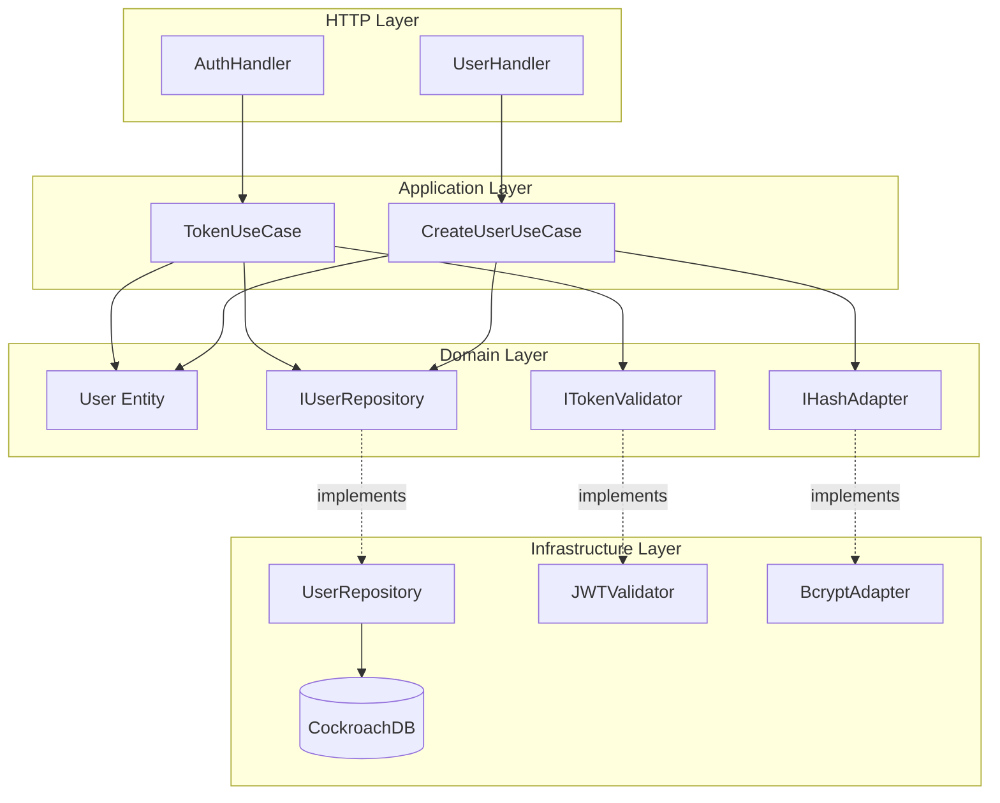
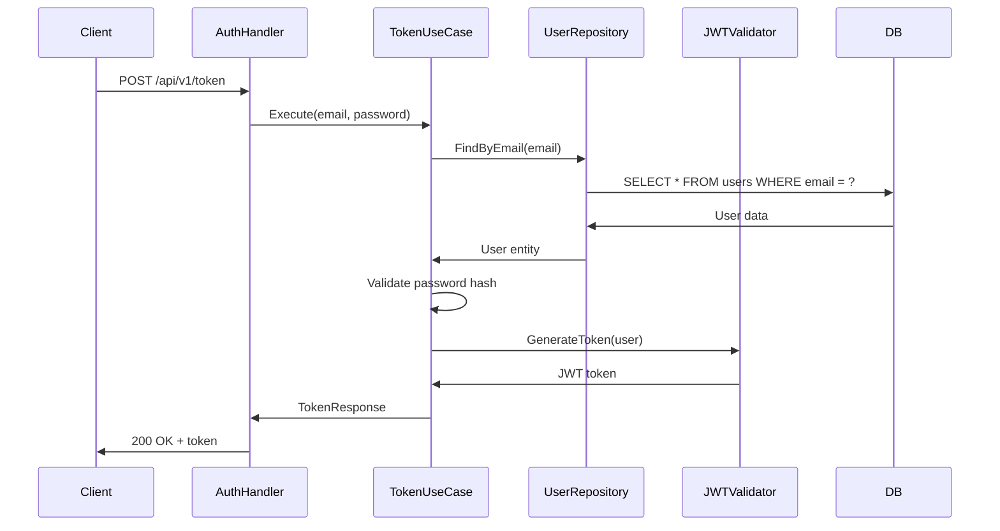
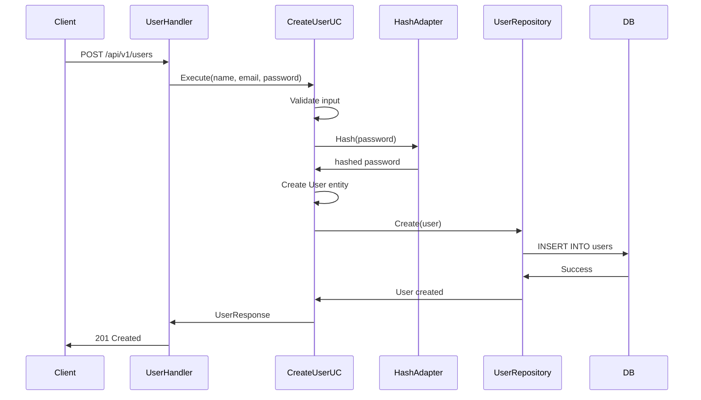

# User Module

Módulo responsável pela autenticação e gerenciamento de usuários do sistema.

## Visão Geral

O módulo User implementa a camada de autenticação da aplicação, fornecendo endpoints para registro de novos usuários e geração de tokens JWT. É o único módulo que não requer autenticação para suas operações principais.

## Arquitetura



### Fluxo de Autenticação



### Fluxo de Criação de Usuário



## Estrutura do Módulo

```
internal/user/
├── application/
│   ├── dtos/
│   │   └── user.go              # DTOs (CreateUserRequest, TokenRequest, etc.)
│   └── usecase/
│       ├── create_user.go       # Criação de usuários
│       └── token.go             # Geração de tokens JWT
├── domain/
│   ├── entities/
│   │   └── user.go              # User entity
│   └── interfaces/
│       ├── hash_adapter.go      # Contrato para hash de senhas
│       ├── token_validator.go   # Contrato para JWT
│       └── user_repository.go   # Contrato de persistência
├── infrastructure/
│   ├── http/
│   │   ├── auth_handler.go      # Handler de autenticação
│   │   ├── user_handler.go      # Handler de usuários
│   │   └── user_routes.go       # Registro de rotas
│   └── repositories/
│       └── user_repository.go   # Implementação do repositório
└── module.go                    # Setup e DI do módulo
```

## API Endpoints

### 1. Generate Token (Login)

Gera um token JWT para autenticação.

```http
POST /api/v1/token
Content-Type: application/json
```

**Request Body:**
```json
{
  "email": "user@example.com",
  "password": "userpassword"
}
```

**Success Response (200 OK):**
```json
{
  "data": {
    "access_token": "eyJhbGciOiJIUzI1NiIsInR5cCI6IkpXVCJ9...",
    "token_type": "Bearer",
    "expires_in": 3600
  }
}
```

**Error Responses:**
- `400 Bad Request` - Dados inválidos
- `401 Unauthorized` - Credenciais incorretas
- `404 Not Found` - Usuário não encontrado

### 2. Create User (Register)

Registra um novo usuário no sistema.

```http
POST /api/v1/users
Content-Type: application/json
```

**Request Body:**
```json
{
  "name": "John Doe",
  "email": "john@example.com",
  "password": "securepassword123"
}
```

**Success Response (201 Created):**
```json
{
  "data": {
    "id": "550e8400-e29b-41d4-a716-446655440000",
    "name": "John Doe",
    "email": "john@example.com",
    "created_at": "2026-01-30T10:30:00Z"
  }
}
```

**Error Responses:**
- `400 Bad Request` - Dados inválidos (email, password format)
- `409 Conflict` - Email já cadastrado

## Domain Model

### User Entity

```go
type User struct {
    ID        uuid.UUID
    Name      string
    Email     string
    Password  string  // Hashed with bcrypt
    CreatedAt time.Time
    UpdatedAt time.Time
    DeletedAt *time.Time
}
```

**Validations:**
- Email deve ser válido
- Password deve ter comprimento mínimo (configurável)
- Name é obrigatório

### Token Claims

```go
type TokenClaims struct {
    UserID string `json:"sub"`
    Email  string `json:"email"`
    jwt.RegisteredClaims
}
```

## Segurança

### Password Hashing

- **Algorithm:** bcrypt
- **Cost Factor:** 10 (padrão devkit-go)
- Senhas nunca são armazenadas em texto plano

### JWT Token

**Configuration:**
- **Algorithm:** HS256 (HMAC with SHA-256)
- **Secret Key:** Configurável via `AUTH_SECRET_KEY` (mínimo 64 caracteres)
- **Duration:** Configurável via `AUTH_TOKEN_DURATION` (em minutos)

**Token Payload:**
```json
{
  "sub": "user-uuid",
  "email": "user@example.com",
  "exp": 1738236600,
  "iat": 1738233000
}
```

**Validação:**
- Verificação de assinatura
- Validação de expiração
- Extração segura de claims

## Interfaces de Domínio

### IUserRepository

```go
type IUserRepository interface {
    Create(ctx context.Context, user *entities.User) error
    FindByEmail(ctx context.Context, email string) (*entities.User, error)
}
```

### ITokenValidator

```go
type ITokenValidator interface {
    GenerateToken(user *entities.User) (string, error)
    ValidateToken(tokenString string) (*TokenClaims, error)
}
```

### IHashAdapter

```go
type IHashAdapter interface {
    Hash(password string) (string, error)
    Compare(hashedPassword, password string) error
}
```

## Use Cases

### CreateUserUseCase

**Responsabilidade:** Criar novos usuários com senha criptografada

**Fluxo:**
1. Validar dados de entrada
2. Verificar se email já existe
3. Hash da senha com bcrypt
4. Criar entidade User
5. Persistir no banco de dados
6. Retornar usuário criado

**Validações:**
- Email único
- Formato de email válido
- Senha atende requisitos mínimos

### TokenUseCase

**Responsabilidade:** Autenticar usuário e gerar JWT token

**Fluxo:**
1. Buscar usuário por email
2. Comparar senha fornecida com hash armazenado
3. Gerar JWT token com claims do usuário
4. Retornar token e metadados

**Validações:**
- Usuário existe
- Senha correta
- Usuário não está deletado (soft delete)

## Database Schema

```sql
CREATE TABLE users (
    id UUID PRIMARY KEY DEFAULT gen_random_uuid(),
    name VARCHAR(100) NOT NULL,
    email VARCHAR(255) NOT NULL UNIQUE,
    password VARCHAR(800) NOT NULL,
    created_at TIMESTAMPTZ NOT NULL DEFAULT NOW(),
    updated_at TIMESTAMPTZ NOT NULL DEFAULT NOW(),
    deleted_at TIMESTAMPTZ
);

CREATE INDEX idx_users_email ON users(email) WHERE deleted_at IS NULL;
CREATE INDEX idx_users_deleted_at ON users(deleted_at);
```

## Métricas

**Status:** Não implementadas

O módulo User atualmente não possui métricas customizadas. As seguintes métricas são candidatas para implementação futura:

### Métricas Sugeridas

- `financial_user_registrations_total` - Total de registros por status
- `financial_user_authentications_total` - Total de autenticações por resultado
- `financial_user_authentication_duration_seconds` - Latência de autenticação
- `financial_user_token_generations_total` - Total de tokens gerados
- `financial_user_password_hash_duration_seconds` - Tempo de hash de senhas

### PromQL Queries (Futuras)

```promql
# Taxa de registro por minuto
rate(financial_user_registrations_total[1m])

# Taxa de falha de autenticação
sum(rate(financial_user_authentications_total{status="failure"}[5m]))
  /
sum(rate(financial_user_authentications_total[5m])) * 100

# P95 latência de autenticação
histogram_quantile(0.95,
  sum(rate(financial_user_authentication_duration_seconds_bucket[5m])) by (le)
)
```

## Dependências

### Externas
- `github.com/JailtonJunior94/devkit-go` - Observability, UoW, Hash adapter
- `github.com/golang-jwt/jwt/v5` - JWT token handling
- `github.com/google/uuid` - UUID generation

### Internas
- `pkg/auth` - JWT validator implementation
- `pkg/custom_errors` - Domain errors
- `pkg/api/http` - HTTP response utilities

## Configuração

### Variáveis de Ambiente

```env
# JWT Configuration
AUTH_SECRET_KEY=your-secret-key-minimum-64-chars
AUTH_TOKEN_DURATION=60  # minutos

# Database
DB_DRIVER=postgres
DB_HOST=localhost
DB_PORT=26257
DB_NAME=financial
DB_USER=root
DB_PASSWORD=your-password
```

### Validações de Segurança

**Produção (`ENVIRONMENT=production`):**
- `AUTH_SECRET_KEY` deve ter mínimo 64 caracteres
- Não aceita passwords padrão como "password", "123456"
- Token duration limitado a 1440 minutos (24 horas)

**Desenvolvimento:**
- Validações relaxadas para facilitar testes
- Permite secret keys menores (não recomendado)

## Error Handling

### Domain Errors

```go
// User not found
custom_errors.NewNotFoundError("user", email)

// Email already exists
custom_errors.NewConflictError("email already registered")

// Invalid credentials
custom_errors.NewUnauthorizedError("invalid credentials")

// Validation errors
custom_errors.NewValidationError(map[string][]string{
    "email": {"invalid email format"},
    "password": {"password too short"},
})
```

### HTTP Status Mapping

| Domain Error | HTTP Status | Scenario |
|--------------|-------------|----------|
| NotFoundError | 404 | User not found |
| ConflictError | 409 | Email already exists |
| UnauthorizedError | 401 | Invalid credentials |
| ValidationError | 400 | Invalid input data |
| InternalError | 500 | Unexpected errors |

## Testing

### Unit Tests

```bash
# Run user module tests
go test ./internal/user/... -v

# With coverage
go test ./internal/user/... -cover -coverprofile=coverage.out
```

### Integration Tests

```bash
# Run with integration tag
go test -tags=integration ./internal/user/... -v
```

### Mock Generation

```bash
# Generate mocks for interfaces
mockery --name=IUserRepository --dir=internal/user/domain/interfaces
mockery --name=ITokenValidator --dir=internal/user/domain/interfaces
mockery --name=IHashAdapter --dir=internal/user/domain/interfaces
```

## Usage Examples

### cURL Examples

**Register User:**
```bash
curl -X POST http://localhost:8000/api/v1/users \
  -H "Content-Type: application/json" \
  -d '{
    "name": "John Doe",
    "email": "john@example.com",
    "password": "securepass123"
  }'
```

**Get Token:**
```bash
curl -X POST http://localhost:8000/api/v1/token \
  -H "Content-Type: application/json" \
  -d '{
    "email": "john@example.com",
    "password": "securepass123"
  }'
```

**Use Token:**
```bash
TOKEN="eyJhbGciOiJIUzI1NiIs..."

curl -X GET http://localhost:8000/api/v1/cards \
  -H "Authorization: Bearer $TOKEN"
```

## Roadmap

### Futuras Implementações

- [ ] Implementar métricas customizadas
- [ ] Adicionar refresh token
- [ ] Suporte a OAuth2 (Google, GitHub)
- [ ] Verificação de email
- [ ] Reset de senha
- [ ] MFA (Multi-Factor Authentication)
- [ ] Rate limiting por usuário
- [ ] Audit log de autenticações

## Referências

- [JWT Best Practices](https://tools.ietf.org/html/rfc8725)
- [OWASP Authentication Cheat Sheet](https://cheatsheetseries.owasp.org/cheatsheets/Authentication_Cheat_Sheet.html)
- [bcrypt - Secure Password Hashing](https://en.wikipedia.org/wiki/Bcrypt)
